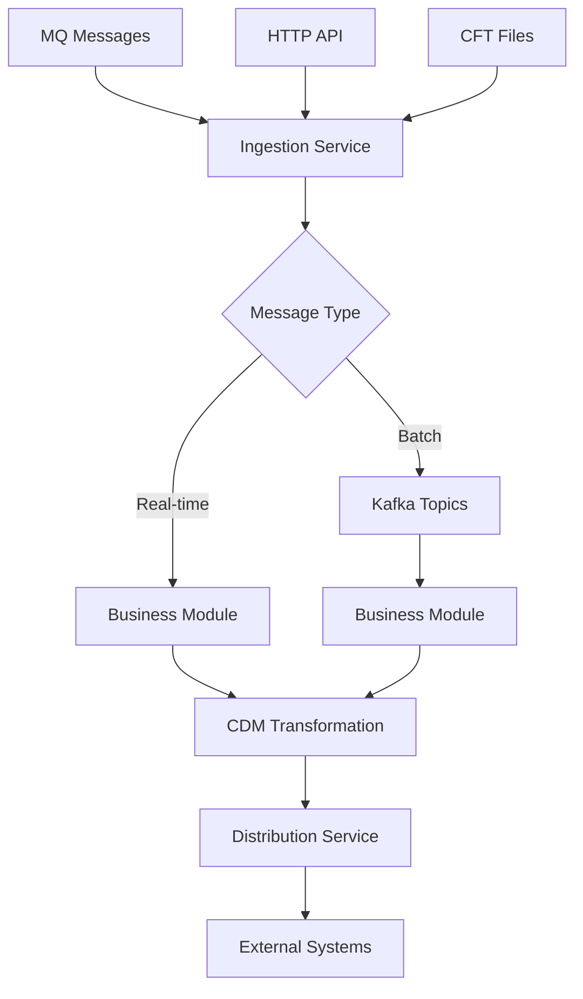

# PIXEL-V2 Payment Processing Platform

> 🚀 **Modern Payment Message Processing System** - A comprehensive, cloud-ready platform for intelligent payment message processing, transformation, and distribution.

[](https://openjdk.java.net/projects/jdk/21/)
[](https://spring.io/projects/spring-boot)
[](https://camel.apache.org/)
[](https://maven.apache.org/)

## 🌟 Overview

PIXEL-V2 is a next-generation payment processing platform built with modern microservices architecture. It provides intelligent message routing, real-time processing capabilities, and comprehensive audit trails for payment messages across multiple channels and formats.

### 🎯 Key Capabilities

| Feature                     | Description                                                    | Technology            |
| --------------------------- | -------------------------------------------------------------- | --------------------- |
| **Multi-Channel Ingestion** | Simultaneous processing from MQ, HTTP, Kafka, and file systems | Apache Camel Kamelets |
| **Intelligent Routing**     | Smart message distribution based on source and content         | Conditional Routing   |
| **Real-Time Processing**    | Sub-second processing for critical payment messages            | Spring Boot + Camel   |
| **Batch Processing**        | High-throughput processing for file-based operations           | Kafka Streams         |
| **Message Transformation**  | ISO 20022 to CDM format conversion                             | XSLT Transformers     |
| **Audit & Compliance**      | Complete transaction trails with centralized logging           | Structured Logging    |

### 📊 Performance Metrics

- **Throughput**: 10,000+ messages/second for batch processing
- **Latency**: <100ms for real-time message processing
- **Availability**: 99.9% uptime with circuit breaker patterns
- **Scalability**: Horizontal scaling with Kafka partitioning

## 🏗️ System Architecture

### 🔄 Message Flow



### 🏢 Module Structure

```
PIXEL-V2/
├── 📋 pom.xml                              # Maven Parent Configuration
├── 📥 ingestion/                           # Message Ingestion & Routing
├── ⚙️ business/                            # Core Business Logic & Processing
├── 📤 distribution/                        # Message Distribution & Delivery
└── 🔧 technical-framework/                 # Reusable Kamelets Library
    ├── k-mq-message-receiver/              # IBM MQ Integration
    ├── k-http-message-receiver/            # REST API Integration
    ├── k-kafka-message-receiver/           # Kafka Integration
    ├── k-cft-data-receiver/                # File System Integration
    ├── k-db-tx/                            # Database Operations
    ├── k-log-tx/                           # Centralized Logging
    ├── k-pacs008-to-cdm-transformer/       # ISO 20022 PACS.008 Transformer
    ├── k-pain001-to-cdm-transformer/       # ISO 20022 PAIN.001 Transformer
    └── ... (8 more specialized kamelets)
```

## � Quick Start

### Prerequisites

- ☕ Java 21+
- 🔧 Maven 3.9+
- 🐳 Docker & Docker Compose
- 🗄️ Oracle Database 19c+ or PostgreSQL 13+

### 🏃‍♂️ Running the Platform

1. **Clone and Build**

   ```bash
   git clone <repository-url>
   cd pixel-v2
   mvn clean install
   ```

2. **Start Infrastructure**

   ```bash
   docker-compose up -d kafka oracle-db
   ```

3. **Launch Services**

   ```bash
   # Terminal 1: Ingestion Service
   cd ingestion && mvn spring-boot:run

   # Terminal 2: Business Module
   cd business && mvn spring-boot:run

   # Terminal 3: Distribution Service
   cd distribution && mvn spring-boot:run
   ```

4. **Health Check**
   ```bash
   curl http://localhost:8080/actuator/health  # Ingestion
   curl http://localhost:8081/actuator/health  # Business
   curl http://localhost:8082/actuator/health  # Distribution
   ```

## 📡 API Reference

### Ingestion Service (Port 8080)

| Endpoint           | Method | Description            | Example               |
| ------------------ | ------ | ---------------------- | --------------------- |
| `/payments/submit` | POST   | Submit payment message | Real-time processing  |
| `/payments/batch`  | POST   | Batch payment upload   | File-based processing |
| `/actuator/health` | GET    | Service health check   | Monitoring            |

### Business Module (Port 8081)

| Endpoint               | Method | Description              | Example            |
| ---------------------- | ------ | ------------------------ | ------------------ |
| `/process/message`     | POST   | Process business message | CDM transformation |
| `/process/status/{id}` | GET    | Processing status        | Track progress     |

### Distribution Service (Port 8082)

| Endpoint             | Method | Description                  | Example                |
| -------------------- | ------ | ---------------------------- | ---------------------- |
| `/distribute/submit` | POST   | Distribute processed message | Final delivery         |
| `/distribute/status` | GET    | Distribution metrics         | Performance monitoring |

## 🔧 Configuration

### Environment Variables

```bash
# Database Configuration
ORACLE_URL=jdbc:oracle:thin:@localhost:1521:XE
ORACLE_USER=pixel_user
ORACLE_PASSWORD=pixel_password

# Kafka Configuration
KAFKA_BROKERS=localhost:9092
KAFKA_GROUP_ID=pixel-v2-group

# MQ Configuration
MQ_HOST=localhost
MQ_PORT=1414
MQ_QUEUE_MANAGER=QM1
```

## 📊 Module Overview

### 📥 Ingestion Service

**Purpose**: Multi-channel message ingestion with intelligent routing

- **Port**: 8080
- **Features**: MQ, HTTP, File ingestion with smart routing capabilities
- **Technology**: Spring Boot + Apache Camel + Kamelets

### ⚙️ Business Module

**Purpose**: Core payment processing and CDM transformation

- **Port**: 8081
- **Features**: Message type detection, ISO 20022 transformation, conditional routing
- **Technology**: Spring Boot + Apache Camel + XSLT

### 📤 Distribution Service

**Purpose**: Message distribution and external system integration

- **Port**: 8082
- **Features**: Multi-channel distribution, audit trails, delivery confirmation
- **Technology**: Spring Boot + Apache Camel + REST APIs

### 🔧 Technical Framework

**Purpose**: Centralized library of reusable Apache Camel Kamelets

- **Components**: 11 specialized kamelets for different integration patterns
- **Categories**: Message Receivers, Processors, Transformers, Infrastructure
- **Benefits**: Code reuse, centralized maintenance, standardized patterns

## 📊 Monitoring & Observability

### Metrics Endpoints

- **Prometheus**: `/actuator/prometheus`
- **Health**: `/actuator/health`
- **Info**: `/actuator/info`
- **Metrics**: `/actuator/metrics`

### Logging Configuration

```yaml
logging:
  level:
    com.pixel.v2: INFO
    org.apache.camel: WARN
  pattern:
    console: "%d{HH:mm:ss.SSS} [%thread] %-5level %logger{36} - %msg%n"
```

## 🧪 Testing

```bash
# Run all tests
mvn test

# Run integration tests
mvn verify -Pintegration-tests

# Run performance tests
mvn verify -Pperformance-tests
```

## 📈 Performance Tuning

### JVM Options

```bash
-Xms2g -Xmx4g
-XX:+UseG1GC
-XX:MaxGCPauseMillis=200
-XX:+UseStringDeduplication
```

### Camel Optimization

```properties
camel.springboot.backlog-tracing=false
camel.springboot.use-mdc-logging=true
camel.component.kafka.configuration.max-poll-records=500
```

## 🔒 Security

- 🔐 **Authentication**: JWT-based security
- 🛡️ **Authorization**: Role-based access control
- 🔏 **Encryption**: TLS 1.3 for all communications
- 📝 **Audit**: Complete audit trail with k-log-tx

## 🚢 Deployment

### Docker Deployment

```bash
docker build -t pixel-v2/ingestion:latest ingestion/
docker build -t pixel-v2/business:latest business/
docker build -t pixel-v2/distribution:latest distribution/
```

### Kubernetes Deployment

```bash
kubectl apply -f k8s/namespace.yaml
kubectl apply -f k8s/configmaps/
kubectl apply -f k8s/services/
```

## 🤝 Contributing

1. Fork the repository
2. Create a feature branch: `git checkout -b feature-name`
3. Commit changes: `git commit -am 'Add feature'`
4. Push to branch: `git push origin feature-name`
5. Submit a Pull Request

## 📄 License

This project is licensed under the MIT License - see the [LICENSE](LICENSE) file for details.

## 📞 Support

- 📧 **Email**: support@pixel-v2.com
- 📖 **Documentation**: [Wiki](../../wiki)
- 🐛 **Issues**: [GitHub Issues](../../issues)
- 💬 **Discussions**: [GitHub Discussions](../../discussions)

---

<div align="center">
  <strong>Built with ❤️ by the PIXEL-V2 Team</strong><br/>
  <em>Modern Payment Processing for the Digital Age</em>
</div>

**Features:**

- Multi-topic consumption (pacs.008, pain.001, default)
- Message deserialization and validation
- Integration with business module
- Error handling and dead letter topic support

### k-db-tx (Enhanced Kamelet)

Kamelet for unified database persistence operations supporting both initial and enriched data storage.

**Features:**

- Dual persistence mode (initial + enriched)
- Transaction management
- Oracle database integration
- Persistence status tracking

## Getting Started

### Prerequisites

- Java Development Kit (JDK) 21 or higher
- Apache Maven 3.9 or higher
- Oracle Database (for JPA persistence and message storage)
- Apache Kafka 2.8+ (for batch processing pipeline)
- IBM MQ (for message queue integration)
- Reference API service (for data enrichment)

### Installation

1. Clone the repository:

   ```bash
   git clone <repository-url>
   cd PIXEL-V2
   ```

2. Build all modules:

   ```bash
   mvn clean install
   ```

3. Run the services:

   **Start Business Module:**

   ```bash
   cd business
   mvn spring-boot:run
   ```

   **Start Distribution Service:**

   ```bash
   cd distribution
   mvn spring-boot:run
   ```

   **Start Ingestion Service:**

   ```bash
   cd ingestion
   mvn spring-boot:run
   ```

### Configuration

#### Ingestion Module Configuration

Configure `ingestion/src/main/resources/application.properties`:

```properties
# Server Configuration
server.port=8080
server.servlet.context-path=/ingestion

# MQ Configuration
ingestion.mq.input.queue=PAYMENT_INPUT
ingestion.mq.host=localhost
ingestion.mq.port=1414
ingestion.mq.queue.manager=QM1
ingestion.mq.channel=DEV.ADMIN.SVRCONN

# File Processing Configuration
ingestion.file.input.directory=/tmp/payments-in
ingestion.file.processed.directory=/tmp/payments-processed
ingestion.file.pattern=*.xml

# Kafka Configuration (for CFT batch processing)
ingestion.kafka.brokers=localhost:9092
ingestion.kafka.topic.pacs008=payments-pacs008
ingestion.kafka.topic.pain001=payments-pain001
ingestion.kafka.topic.default=payments-processed
ingestion.kafka.topic.rejected=payments-rejected
ingestion.kafka.topic.errors=payments-errors

# 🆕 Business Module Integration (for HTTP/MQ real-time processing)
ingestion.processing.enabled=true
ingestion.processing.endpoint=direct:kafka-message-processing
```

#### Business Module Configuration

Configure `business/src/main/resources/application.properties`:

```properties
# Server Configuration
server.port=8081
server.servlet.context-path=/processing

# Kafka Integration (receives from ingestion module)
processing.kafka.brokers=localhost:9092
processing.kafka.consumer.group=processing-group

# CDM Transformer Integration
processing.transformers.pacs008.endpoint=kamelet:k-pacs-008-to-cdm
processing.transformers.pain001.endpoint=kamelet:k-pain001-to-cdm-transformer
processing.transformers.default.endpoint=direct:default-handler

# 🆕 Conditional Routing Configuration
distribution.service.endpoint=http://localhost:8082/distribution/submit
kafka.output.broker=localhost:9092
kafka.output.topic=cdm-processed-messages
```

#### Distribution Module Configuration

Configure `distribution/src/main/resources/application.properties`:

```properties
# Server Configuration
server.port=8082
server.servlet.context-path=/distribution

# Kafka Integration (for message consumption)
spring.kafka.bootstrap-servers=localhost:9092
spring.kafka.consumer.group-id=distribution-service
spring.kafka.consumer.auto-offset-reset=earliest

# Camel Configuration
camel.springboot.name=distribution-camel
camel.springboot.main-run-controller=true

# Logging Configuration
logging.level.com.pixel.v2.distribution=INFO
logging.level.org.apache.camel=INFO
```

## Dependencies

**Core Technologies:**

- Spring Boot 3.5.0
- Apache Camel 4.1.0
- Spring Framework 6.2.0
- Jakarta Persistence API 3.1.0
- Apache Kafka 2.8+
- Saxon XSLT Processor
- Oracle Database JDBC Driver
- IBM MQ Integration
- Jackson JSON Processing

**🆕 New Technologies:**

- **Smart Routing Engine**: Camel-based intelligent message routing
- **Message Type Detection**: XML/JSON format detection and processing
- **Dual Processing Architecture**: Real-time + batch processing optimization

## 🔄 Smart Routing Usage

### Message Flow Examples

#### Real-time Processing (HTTP/MQ)

```bash
# Submit payment via HTTP API (routes to business module)
curl -X POST http://localhost:8080/ingestion/api/v1/payments \
  -H "Content-Type: application/json" \
  -d '{
    "messageType": "pacs.008",
    "payload": "<?xml version=\"1.0\"?>..."
  }'
```

#### Batch Processing (CFT Files)

```bash
# Place XML file in watched directory (routes to Kafka)
cp payment.xml /tmp/payments-in/

# Monitor processing
tail -f logs/ingestion.log | grep "CFT message - routing to Kafka"
```

### Routing Decision Matrix

| Source Channel | Processing Type | Route Destination       | Benefits                          |
| -------------- | --------------- | ----------------------- | --------------------------------- |
| **HTTP API**   | Real-time       | Business Module         | Low latency, immediate response   |
| **MQ Series**  | Real-time       | Business Module         | Low latency, persistent delivery  |
| **CFT Files**  | Batch           | Kafka → Business Module | High throughput, memory efficient |

### Monitoring & Health Checks

```bash
# Check application health
curl http://localhost:8080/ingestion/health
curl http://localhost:8081/processing/health
curl http://localhost:8082/distribution/health

# Monitor Camel routes
curl http://localhost:8080/ingestion/actuator/camelroutes
curl http://localhost:8081/processing/actuator/camelroutes
curl http://localhost:8082/distribution/routes

# View processing metrics
curl http://localhost:8081/processing/actuator/metrics
curl http://localhost:8082/distribution/actuator/metrics
```

### Performance Benefits

- **🚀 50-70% Latency Reduction**: HTTP/MQ messages bypass Kafka queuing
- **📈 High Throughput**: CFT files maintain optimized batch processing
- **🔄 Flexible Scaling**: Independent scaling of real-time vs batch processing
- **🛡️ Reliability**: Graceful fallback and comprehensive error handling

## Contributing

Contributions are welcome! Please submit a pull request or open an issue for any enhancements or bug fixes.

## License

This project is licensed under the BNP CIB License. See the LICENSE file for details.
