# ⚙️ Business Module

[](https://spring.io/projects/spring-boot)
[](https://camel.apache.org/)
[](https://openjdk.java.net/projects/jdk/21/)

> 🎯 **Core Payment Processing Engine** - Intelligent message transformation and routing with CDM conversion.

## Overview

The Business Module processes payment messages from the ingestion service, automatically detects message types, transforms them to CDM format using specialized kamelets, and routes the results to the appropriate destination based on message origin.

**Key Features:**

- 🔍 **Smart Message Detection**: Automatic identification of PACS.008, PACS.009, PAIN.001, CAMT.053
- 🔄 **CDM Transformation**: ISO 20022 to Common Data Model conversion
- 🚀 **Dual Processing**: Real-time (HTTP) and batch (Kafka) support
- 📊 **Conditional Routing**: Routes based on message origin (Kafka → Kafka, HTTP → Distribution)

## 🏗️ Processing Flow

```mermaid
flowchart TB
    A[📥 Ingestion Module]

    A --> B{🔀 Input Channel}

    B -->|Real-time| C[🌐 HTTP Direct Calls]
    B -->|Batch| D[📊 Kafka Topics]

    C --> E[🎯 Message-Type Routes]
    D --> F[🔍 MessageTypeProcessor]

    E --> E1[📄 /pacs-008-transform]
    E --> E2[📄 /pacs-009-transform]
    E --> E3[📄 /pain-001-transform]
    E --> E4[📄 /camt-053-transform]

    F --> G{Message Type Detection}

    E1 --> H1[🔄 k-pacs-008-to-cdm]
    E2 --> H2[🔄 k-pacs009-to-cdm-transformer]
    E3 --> H3[🔄 k-pain001-to-cdm-transformer]
    E4 --> H4[🔄 k-camt053-to-cdm-transformer]

    G -->|pacs.008| H1
    G -->|pacs.009| H2
    G -->|pain.001| H3
    G -->|camt.053| H4
    G -->|unknown| I[❌ Error Handler]

    H1 --> J[📋 CDM Output]
    H2 --> J
    H3 --> J
    H4 --> J

    J --> K{🎯 Message Origin Check}

    K -->|Kafka Source| L[📤 Kafka Output Topic<br/>cdm-processed-messages]
    K -->|HTTP/MQ Source| M[🚀 Distribution Service<br/>localhost:8082/submit]

    I --> N[🔗 k-log-tx<br/>Error Logging]

    %% Styling
    style A fill:#e3f2fd,stroke:#1976d2,stroke-width:2px
    style F fill:#e8f5e8,stroke:#388e3c,stroke-width:2px
    style J fill:#fce4ec,stroke:#c2185b,stroke-width:2px
    style L fill:#fff3e0,stroke:#f57c00,stroke-width:2px
    style M fill:#e0f2f1,stroke:#00796b,stroke-width:2px
    style I fill:#ffebee,stroke:#d32f2f,stroke-width:2px
    style N fill:#f3e5f5,stroke:#7b1fa2,stroke-width:2px
```



## 🎯 Core Components

### 🧠 MessageTypeProcessor

- **Purpose**: Intelligent content analysis and routing
- **Features**: XML/JSON parsing, header enrichment, metadata extraction
- **Output**: MessageType and RouteTarget headers

### 🔄 CDM Transformers

| Kamelet                        | Purpose                             | Technology     | Output           |
| ------------------------------ | ----------------------------------- | -------------- | ---------------- |
| `k-pacs-008-to-cdm`            | ISO 20022 PACS.008 → CDM conversion | Saxon XSLT 3.0 | Standardized CDM |
| `k-pacs009-to-cdm-transformer` | ISO 20022 PACS.009 → CDM conversion | Saxon XSLT 3.0 | Standardized CDM |
| `k-pain001-to-cdm-transformer` | ISO 20022 PAIN.001 → CDM conversion | Saxon XSLT 3.0 | Standardized CDM |
| `k-camt053-to-cdm-transformer` | ISO 20022 CAMT.053 → CDM conversion | Saxon XSLT 3.0 | Standardized CDM |

### 🚦 Conditional Router

- **Logic**: Routes based on message origin (`messageSource` header)
- **Kafka Origin** (`"KAFKA_TOPIC"`) → Returns to Kafka ecosystem for batch processing
- **HTTP/MQ Origin** → Forwards to Distribution Service

## 📋 Supported Message Types

| ISO 20022 Type | Description              | Detection Patterns                 |
| -------------- | ------------------------ | ---------------------------------- |
| **PACS.008**   | Customer Credit Transfer | `pacs.008`, `FIToFICstmrCdtTrf`    |
| **PACS.009**   | Credit Transfer Return   | `pacs.009`, `FIToFICstmrCdtTrfRtr` |
| **PAIN.001**   | Payment Initiation       | `pain.001`, `CstmrCdtTrfInitn`     |
| **CAMT.053**   | Account Statement        | `camt.053`, `BkToCstmrStmt`        |

## ⚙️ Configuration

### 📝 Application Properties

```properties
# Main Processing Endpoints
processing.kafka.input.endpoint=direct:kafka-message-processing
processing.cdm.output.endpoint=direct:cdm-output

# Conditional Routing
business.service.endpoint=http://localhost:8082/submit
kafka.output.topic=cdm-processed-messages

# Message Type Detection
message.detection.xml.enabled=true
message.detection.json.enabled=true
message.detection.fallback.route=direct:unknown-message
```

### 🔄 Kamelet Configuration

```properties
# Transformer Kamelets
transformers.pacs008.endpoint=kamelet:k-pacs-008-to-cdm
transformers.pain001.endpoint=kamelet:k-pain001-to-cdm-transformer
transformers.logging.endpoint=kamelet:k-log-tx
```

## 🚀 API Endpoints

### HTTP Direct Integration

```http
POST /business/api/direct/pacs-008-transform
POST /business/api/direct/pacs-009-transform
POST /business/api/direct/pain-001-transform
POST /business/api/direct/camt-053-transform
POST /business/api/direct/kafka-message-processing
```

### Health & Monitoring

```http
GET /actuator/health
GET /actuator/metrics
GET /actuator/camel/routes
```

## 🧪 Testing

### Unit Tests

```bash
# Run all tests
mvn test

# Test specific components
mvn test -Dtest=MessageTypeProcessorTest
```

### Integration Tests

```bash
# Full integration test suite
mvn verify -P integration-tests
```

## 🔧 Installation

### Prerequisites

- Java 21+
- Apache Maven 3.8+
- Apache Kafka 3.0+ (for batch processing)
- Required kamelets: k-pacs-008-to-cdm, k-pain001-to-cdm-transformer, k-log-tx

### Build and Run

```bash
# Build the application
mvn clean install

# Run the application
mvn spring-boot:run

# Or run the JAR
java -jar target/business-1.0.1-SNAPSHOT.jar
```

## 📊 Monitoring

### Key Metrics

- **Message Processing Rate**: Messages processed per second
- **Message Type Distribution**: Breakdown by PACS.008, PACS.009, PAIN.001, CAMT.053
- **Transformation Success Rate**: Successful CDM transformations
- **Route Performance**: Latency by processing route (HTTP vs Kafka)

### Logging

```properties
# Enable debug logging
logging.level.com.pixel.v2.business=DEBUG
logging.level.org.apache.camel=INFO
```

## 🛡️ Error Handling

| Error Type                | Handler                  | Recovery Action                  |
| ------------------------- | ------------------------ | -------------------------------- |
| **Unknown Message Type**  | `direct:unknown-message` | Route to DLQ, manual review      |
| **Transformation Errors** | Kamelet error handler    | Retry 3x, then DLQ               |
| **Routing Failures**      | Circuit breaker          | Fallback routing, alert ops team |

## 🔗 Dependencies

### Required Modules

- **Ingestion Module**: Real-time message input via direct calls
- **Distribution Module**: CDM message output for HTTP/MQ originated messages
- **Kafka Cluster**: Batch processing for CFT file messages

### Kamelet Ecosystem

- `k-kafka-message-receiver`: Kafka topic consumption
- `k-pacs-008-to-cdm`: PACS.008 transformation
- `k-pain001-to-cdm-transformer`: PAIN.001 transformation
- `k-log-tx`: Transaction logging

---

**For detailed integration documentation**:

- [Ingestion Module README](../ingestion/README.md)
- [Distribution Module README](../distribution/README.md)
- [Technical Framework README](../technical-framework/README.md)
