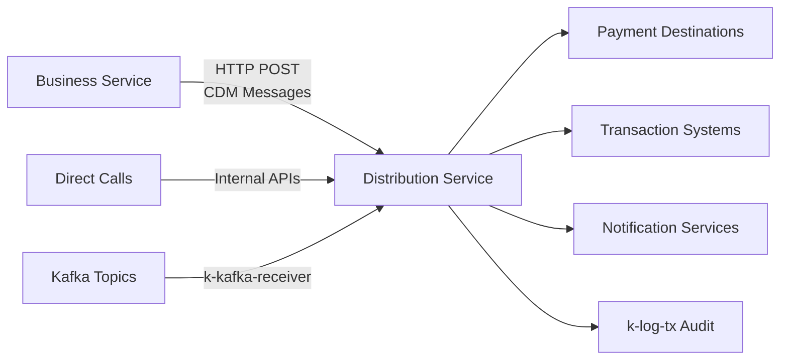
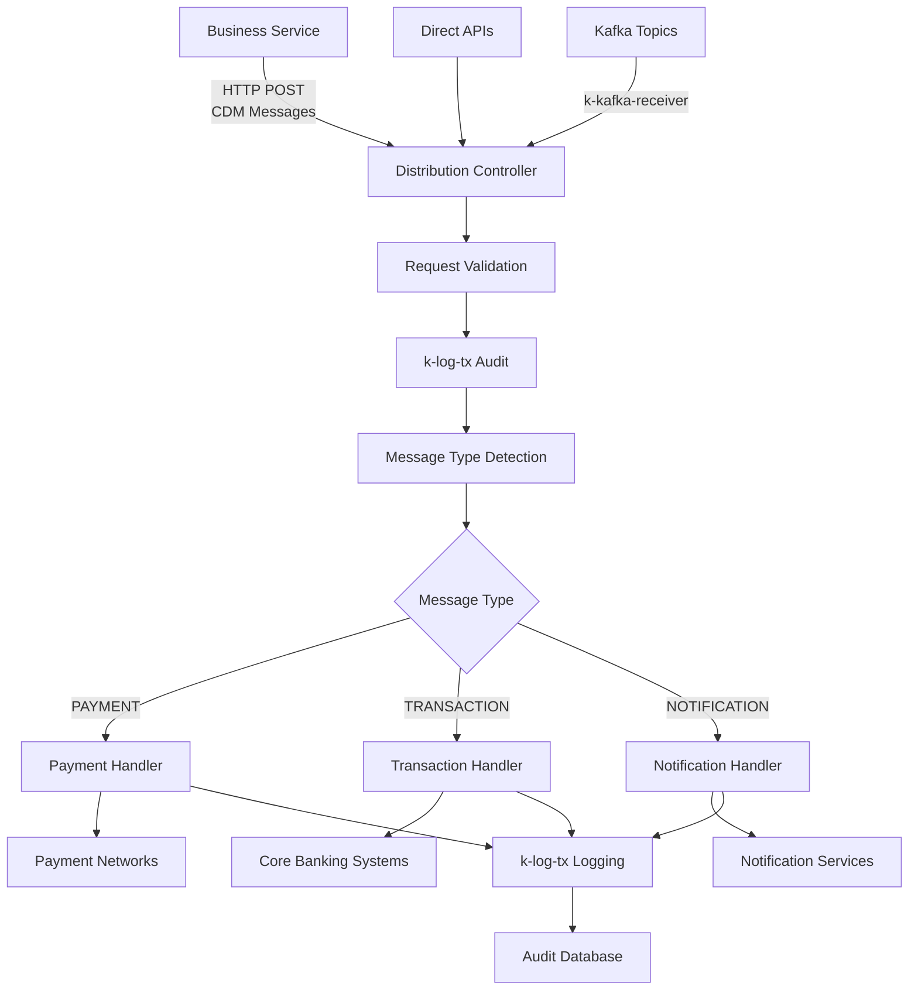

# 📤 Distribution Service

[](https://github.com/your-org/pixel-v2)
[](https://github.com/your-org/pixel-v2/releases)
[](https://spring.io/projects/spring-boot)
[](https://camel.apache.org)
[](https://openjdk.java.net/projects/jdk/21/)

> **Centralized Message Distribution Hub** - Intelligent routing and delivery of processed payment messages with comprehensive logging and audit trails.

## 🎯 Overview

The Distribution Service serves as the **primary message distribution hub** within the PIXEL-V2 platform, receiving CDM-processed messages from the Business Service and routing them to appropriate destinations based on message type and business rules.

### 🔄 Core Capabilities

| Capability                | Description                                                        | Technology Stack               |
| ------------------------- | ------------------------------------------------------------------ | ------------------------------ |
| **CDM Message Reception** | Receives processed messages from Business Service                  | HTTP REST + Spring Boot        |
| **Intelligent Routing**   | Routes messages based on type (Payment, Transaction, Notification) | Apache Camel + Dynamic Routing |
| **Audit Logging**         | Complete transaction audit trail                                   | k-log-tx Kamelet               |
| **Multi-Channel Output**  | Flexible destination routing and delivery                          | Configurable Endpoints         |
| **Error Recovery**        | Comprehensive error handling with DLQ support                      | Circuit Breaker Pattern        |

### 🎯 Service Integration



## 🏗️ System Architecture

### 🔄 Distribution Flow



### 📋 Core Components

#### 🌐 HTTP Reception Layer

- **DistributionController**: REST endpoint for CDM message reception
- **Request Validation**: Schema validation and header extraction
- **Camel Integration**: Seamless routing to internal processing pipeline

#### 🧠 Message Processing Pipeline

| Stage          | Component         | Purpose                | Technology          |
| -------------- | ----------------- | ---------------------- | ------------------- |
| **Reception**  | HTTP Controller   | Receive CDM messages   | Spring Boot REST    |
| **Validation** | Message Validator | Validate CDM structure | JSON Schema         |
| **Audit**      | k-log-tx          | Transaction logging    | Kamelet Integration |
| **Routing**    | Message Router    | Type-based routing     | Apache Camel        |

#### 🎯 Message Handlers

| Handler                  | Message Types                   | Destinations                   | Features                              |
| ------------------------ | ------------------------------- | ------------------------------ | ------------------------------------- |
| **Payment Handler**      | Payment instructions, transfers | SWIFT, ACH, Real-time payments | Amount validation, party verification |
| **Transaction Handler**  | Status updates, settlements     | Core banking, account systems  | Status tracking, approval flows       |
| **Notification Handler** | Alerts, confirmations           | Email, SMS, mobile apps        | Multi-channel delivery                |

### 📥 Input Sources

| Source               | Description                | Entry Point                 | Message Format  |
| -------------------- | -------------------------- | --------------------------- | --------------- |
| **Business Service** | Primary CDM message source | `POST /submit`              | CDM JSON        |
| **Direct APIs**      | Internal service calls     | `direct:distribution-input` | Various formats |
| **Kafka Topics**     | Batch message processing   | k-kafka-receiver kamelet    | Kafka messages  |

### 📤 Output Destinations

#### Payment Networks

- **SWIFT Network**: Cross-border payments and messaging
- **ACH Systems**: Domestic batch transfers
- **Real-time Payments**: Instant payment networks

#### Core Banking

- **Account Updates**: Balance and transaction history
- **Status Management**: Payment status tracking
- **Settlement Processing**: Transaction finalization

#### Notification Services

- **Email Gateway**: Email notifications and confirmations
- **SMS Service**: Mobile text notifications
- **Push Notifications**: Mobile app alerts
  │ • External API │ │ • Success rates │ │ • Alert │ │ mechanisms │
  │ availability │ │ • Error rates │ │ generation │ │ │
  └─────────────────┘ └─────────────────┘ └─────────────────┘ └─────────────────┘

```

### 📋 Message Sources Priority & Usage

| Priority | Source Type       | Use Case                 | Volume | Latency  |
| -------- | ----------------- | ------------------------ | ------ | -------- |
| **1**    | Processing Module | Primary CDM distribution | High   | Low      |
| **2**    | Direct Endpoints  | Internal service calls   | Medium | Very Low |
| **3**    | Kafka Topics      | Batch processing backup  | Low    | Medium   |

### 🔄 Integration Patterns

#### Primary Integration: Processing Module → Business Service

```

Processing Module Conditional Router:
if (messageSource != "KAFKA_TOPIC") {
HTTP POST → localhost:8082/business/submit
Headers: messageType, processingStage, TransformationComplete
Body: CDM-processed JSON payload
}

```

### 🔄 Simplified Message Flow

```

Input Reception → Validation → Processing → Type Detection → Routing → External Delivery

┌─────────────┐ ┌─────────────┐ ┌─────────────┐ ┌─────────────┐ ┌─────────────┐ ┌─────────────┐
│ Processing │ │ HTTP │ │ k-log-tx │ │ Message │ │ Type- │ │ External │
│ Module │──▶│ Endpoint │──▶│ Logging │──▶│ Processor │──▶│ Specific │──▶│ Systems │
│(Conditional)│ │ :8082/submit│ │ (Audit) │ │ (Detection) │ │ Routing │ │ (Delivery) │
└─────────────┘ └─────────────┘ └─────────────┘ └─────────────┘ └─────────────┘ └─────────────┘
│ │ │ │ │ │
▼ ▼ ▼ ▼ ▼ ▼
CDM-processed Message Centralized Type Detection Business Rules Final Delivery
messages from validation audit trail (PAYMENT/TRANS/ application to payment
conditional & header creation NOTIFICATION) based on type networks
router enrichment

Flow Details:

1. Processing Module → HTTP POST with CDM payload and headers
2. BusinessController → Request validation and header extraction
3. Camel Routes → direct:business-input message injection
4. k-log-tx → Centralized logging and audit trail creation
5. BusinessMessageProcessor → Intelligent type detection and enrichment
6. Message Router → Type-specific routing (payment/transaction/notification)
7. External Systems → Final delivery to appropriate external channels

````

### Message Sources

1. **🆕 Processing Module (Primary)**: Receives CDM-processed messages via HTTP POST from processing module's conditional router
2. **Direct Endpoints**: Messages can be sent directly to `direct:business-input`
3. **Kafka Topics**: Messages are consumed from configured Kafka topics using k-kafka-message-receiver

### Message Flow

#### 🆕 Primary Flow (from Processing Module)

1. **HTTP Reception**: Processing module POSTs CDM-processed messages to `/business/submit`
2. **Message Validation**: Validates CDM format and required headers
3. **Centralized Logging**: Logs with k-log-tx for audit trail
4. **Type Detection**: Detects message type from CDM content
5. **Message Routing**: Routes based on detected type and business rules
6. **Delivery Processing**: Handles final delivery to external systems
7. **Completion Logging**: Logs successful processing and delivery status

#### Traditional Flow (Kafka/Direct)

1. Message Reception (direct or Kafka)
2. Logging with k-log-tx
3. Message Processing (type detection, validation, enrichment)
4. Message Routing based on type
5. Final output and audit logging

### Supported Message Types

- **🆕 CDM_PROCESSED**: CDM-transformed messages from processing module (primary type)
- **PAYMENT**: Payment messages (pacs.008, JSON with payment fields)
- **TRANSACTION**: Transaction messages (pain.001, JSON with transaction fields)
- **NOTIFICATION**: Notification messages (text, JSON with notification fields)
- **UNKNOWN/GENERIC**: Fallback for unrecognized message types

### 🆕 CDM Message Processing

The business service has enhanced capabilities for handling CDM-processed messages:

- **CDM Validation**: Validates CDM structure and required fields
- **Header Enrichment**: Adds business-specific headers for routing
- **Correlation Tracking**: Maintains correlation with original source messages
- **Processing Stage Awareness**: Recognizes messages are already CDM-transformed

## Configuration

### Application Properties

Key configuration properties in `application.properties`:

```properties
# Service Configuration
spring.application.name=business-service
server.port=8082

# 🆕 Processing Module Integration
processing.integration.enabled=true
processing.module.endpoint=http://localhost:8081/processing

# Kafka Configuration
spring.kafka.bootstrap-servers=localhost:9092
spring.kafka.consumer.group-id=business-service-group
spring.kafka.consumer.auto-offset-reset=earliest

# Camel Configuration
camel.springboot.name=business-camel
camel.springboot.main-run-controller=true
camel.springboot.jmx-enabled=true

# Direct Endpoint Configuration
business.direct.input-endpoint=direct:business-input
business.direct.output-endpoint=direct:business-output

# 🆕 CDM Processing Configuration
business.cdm.validation.enabled=true
business.cdm.correlation.tracking=true

# Logging Configuration
logging.level.com.pixel.v2.business=INFO
logging.level.org.apache.camel=INFO
````

### Camel Routes

Routes are defined in YAML DSL format in `src/main/resources/camel/business-routes.yaml`:

- `business-direct-input`: Handles direct endpoint messages
- `business-kafka-input`: Handles Kafka messages via k-kafka-message-receiver
- `business-message-processor`: Main processing logic
- `business-message-router`: Routes messages by type
- Type-specific handlers: payment, transaction, notification, default
- `business-error-handler`: Error handling and logging

## Components

### BusinessMessageProcessor

Custom processor (`com.pixel.v2.business.processor.BusinessMessageProcessor`) that:

- Detects message type based on content structure
- Extracts message identifiers (payment ID, transaction ID, etc.)
- Enriches messages with processing metadata
- Handles errors gracefully

### BusinessController

REST controller (`com.pixel.v2.business.controller.BusinessController`) providing:

- **🆕 `/business/submit`** - **Primary endpoint** for receiving CDM messages from processing module
- `/business/submit-with-headers` - Submit messages with custom headers
- `/business/health` - Service health check
- `/business/routes` - Active Camel routes information

#### 🆕 Processing Module Integration

The `/business/submit` endpoint is specifically designed for processing module integration:

```java
@PostMapping("/submit")
public ResponseEntity<Map<String, Object>> submitMessage(
    @RequestBody String messageBody,
    HttpServletRequest request) {

    // Extract headers from processing module
    Map<String, Object> headers = extractProcessingHeaders(request);

    // Validate CDM format if messageType is CDM_PROCESSED
    if ("CDM_PROCESSED".equals(headers.get("messageType"))) {
        validateCdmMessage(messageBody);
    }

    // Send to Camel route for processing
    producerTemplate.sendBodyAndHeaders("direct:business-input", messageBody, headers);

    return ResponseEntity.ok(createSuccessResponse());
}
```

## Usage

### Starting the Service

```bash
mvn spring-boot:run
```

### 🆕 Submitting CDM Messages from Processing Module

The primary use case - processing module sending CDM-processed messages:

```bash
# This is automatically done by the processing module's conditional router
curl -X POST http://localhost:8082/business/submit \
  -H "Content-Type: application/json" \
  -H "messageType: CDM_PROCESSED" \
  -H "processingStage: CDM_TRANSFORMATION_COMPLETE" \
  -H "TransformationComplete: true" \
  -d '{
    "cdmType": "PAYMENT_INSTRUCTION",
    "instructionId": "INST123",
    "amount": 1000.00,
    "currency": "EUR",
    "debtorInfo": {...},
    "creditorInfo": {...}
  }'
```

### Direct Message Submission

```bash
curl -X POST http://localhost:8082/business/submit \
  -H "Content-Type: application/json" \
  -d '{"paymentId": "PAY123", "amount": 1000.00, "creditor": "John Doe"}'
```

#### Message with Headers

```bash
curl -X POST "http://localhost:8082/business/submit-with-headers?messageType=PAYMENT&priority=HIGH" \
  -H "Content-Type: application/json" \
  -d '{"paymentId": "PAY456", "amount": 2000.00}'
```

### Health Check

```bash
curl http://localhost:8082/business/health
```

### Route Information

```bash
curl http://localhost:8082/business/routes
```

## Dependencies

### Kamelets Used

- **k-kafka-message-receiver**: For consuming messages from Kafka topics
- **k-log-tx**: For centralized logging and audit trails

### Key Dependencies

- Spring Boot 3.4.1
- Apache Camel 4.1.0
- Jackson for JSON processing
- Oracle JDBC driver
- Camel Kafka component
- Camel YAML DSL

## Integration

### With Other Services

The business service is designed to integrate with:

- **🆕 Processing Service (Primary)**: Receives CDM-processed messages via conditional routing HTTP POST
- **Ingestion Service**: Can receive messages from the ingestion pipeline
- **External Systems**: Routes messages to external payment networks, notification systems, etc.
- **🆕 Monitoring Systems**: Provides comprehensive logging and metrics for all processed messages

### 🆕 Processing Module Conditional Routing Integration

The business service is the **primary destination** for non-Kafka messages in the processing module's conditional routing:

```java
// Processing Module Route Configuration
choice()
    .when(header("messageSource").isEqualTo("KAFKA_TOPIC"))
        .to("kafka:cdm-processed-messages?brokers=localhost:9092")
    .otherwise()
        .to("http://localhost:8082/business/submit")  // Routes to business service
```

**Message Flow:**

```
HTTP/MQ Messages → Processing Module → CDM Transformation → Business Service
```

**Benefits:**

- **Centralized Distribution**: All non-Kafka CDM messages go through business service
- **Unified Logging**: Comprehensive audit trail via k-log-tx
- **Flexible Routing**: Business service can route to multiple external systems
- **Error Handling**: Centralized error processing and retry logic

### Kafka Integration

Configure Kafka topics in application properties:

```properties
business.kafka.topics.input=processed-payments,processed-transactions,notifications
```

### Database Integration

Uses the same database configuration as other PIXEL-V2 services for logging via k-log-tx.

## Monitoring

### Actuator Endpoints

- `/actuator/health` - Spring Boot health check
- `/actuator/camel` - Camel-specific metrics
- `/actuator/metrics` - Application metrics

### Logging

All message processing is logged through k-log-tx with different log levels:

- INFO: Normal processing flow
- WARN: Unknown message types
- ERROR: Processing failures

### Custom Monitoring

The service provides custom endpoints for monitoring:

- Route status and statistics
- Message processing metrics
- Error rates and patterns

## Development

### Adding New Message Types

1. Update `BusinessMessageProcessor.detectMessageType()` method
2. Add new processing method (e.g., `processCustomMessage()`)
3. Add new route handler in `business-routes.yaml`
4. Update routing logic in `business-message-router`

### Extending Routing Logic

Add new routes in `business-routes.yaml` following the existing pattern:

```yaml
- route:
    id: "business-custom-handler"
    from:
      uri: "direct:business-custom-handler"
      steps:
        - log:
            message: "[CUSTOM-HANDLER] Processing custom message"
        # Add custom processing steps
```

## Testing

### Unit Tests

Run unit tests with:

```bash
mvn test
```

### Integration Tests

Integration tests use embedded Kafka and H2 database for testing complete message flows.

### Manual Testing

Use the REST endpoints to submit test messages and verify processing through logs and database entries.

## Troubleshooting

### Common Issues

1. **Kafka Connection**: Check bootstrap servers configuration
2. **Database Connection**: Verify Oracle database connectivity
3. **Route Failures**: Check Camel route definitions and dependencies
4. **Message Processing**: Review BusinessMessageProcessor logic and logs

### Debug Logging

Enable debug logging for troubleshooting:

```properties
logging.level.com.pixel.v2.business=DEBUG
logging.level.org.apache.camel=DEBUG
```
