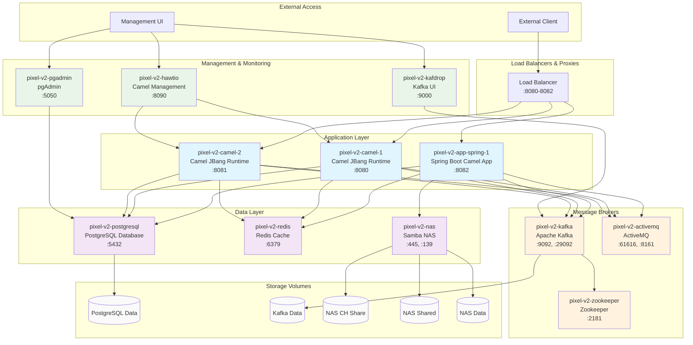

# PIXEL-V2 Docker Infrastructure

## Overview

The PIXEL-V2 Docker infrastructure provides a complete containerized environment for payment processing, featuring message brokers, databases, caching, file storage, and monitoring tools. All services are orchestrated using Docker Compose and connected through a dedicated network.

## Architecture Diagram



## Services Overview

### Application Services

| Service                   | Container             | Description                            | Ports                | Dependencies                            |
| ------------------------- | --------------------- | -------------------------------------- | -------------------- | --------------------------------------- |
| **pixel-v2-app-spring-1** | Spring Boot Camel App | Main CH payment processing application | 8082:8080, 8782:8778 | PostgreSQL, Redis, ActiveMQ, Kafka, NAS |
| **pixel-v2-camel-1**      | Camel JBang Runtime   | Camel integration runtime instance 1   | 8080:8080            | PostgreSQL, Redis, ActiveMQ, Kafka      |
| **pixel-v2-camel-2**      | Camel JBang Runtime   | Camel integration runtime instance 2   | 8081:8080            | PostgreSQL, Redis, ActiveMQ, Kafka      |

### Message Brokers

| Service       | Container          | Description                    | Ports                  | Dependencies |
| ------------- | ------------------ | ------------------------------ | ---------------------- | ------------ |
| **kafka**     | pixel-v2-kafka     | Apache Kafka message streaming | 9092:9092, 29092:29092 | Zookeeper    |
| **activemq**  | pixel-v2-activemq  | ActiveMQ JMS broker            | 61616:61616, 8161:8161 | None         |
| **zookeeper** | pixel-v2-zookeeper | Kafka coordination service     | 2181:2181              | None         |

### Data Services

| Service        | Container           | Description           | Ports            | Dependencies |
| -------------- | ------------------- | --------------------- | ---------------- | ------------ |
| **postgresql** | pixel-v2-postgresql | PostgreSQL database   | 5432:5432        | None         |
| **redis**      | pixel-v2-redis      | Redis cache           | 6379:6379        | None         |
| **nas**        | pixel-v2-nas        | Samba NAS file server | 445:445, 139:139 | None         |

### Management & Monitoring

| Service     | Container        | Description               | Ports     | Dependencies    |
| ----------- | ---------------- | ------------------------- | --------- | --------------- |
| **pgadmin** | pixel-v2-pgadmin | PostgreSQL administration | 5050:80   | PostgreSQL      |
| **kafdrop** | pixel-v2-kafdrop | Kafka topics browser      | 9000:9000 | Kafka           |
| **hawtio**  | pixel-v2-hawtio  | Camel routes management   | 8090:8080 | Camel instances |

## Directory Structure

```
docker/
├── docker-compose.yml              # Main orchestration file
├── README.md                       # This file
├── NAS-README.md                   # NAS-specific documentation
├── routes                          # Camel route definitions
├── kafka/
│   ├── Dockerfile                  # Custom Kafka image
│   ├── create-pixel-topics.sh     # Topic creation script
│   └── kafka-pixel-v2.properties  # Kafka configuration
├── postgresql/
│   ├── Dockerfile                  # Custom PostgreSQL image
│   ├── init-pixel-v2-db.sql       # Database initialization
│   ├── postgresql.conf             # PostgreSQL configuration
│   └── pg_hba.conf                # Authentication configuration
├── camel-runtime-spring/
│   ├── Dockerfile                  # Spring Boot Camel runtime
│   ├── entrypoint.sh              # Container startup script
│   └── camel-application.properties
├── camel-runtime-jbang/
│   ├── Dockerfile                  # JBang Camel runtime
│   └── entrypoint.sh              # Container startup script
├── referentiel-runtime/
│   └── Dockerfile                  # Referential service
└── hawtio/
    └── Dockerfile                  # HawtIO management console
```

## Network Configuration

All services communicate through the `pixel-v2-network` Docker network:

- **Network Type**: Bridge
- **Driver**: Default bridge driver
- **DNS**: Automatic container name resolution
- **Isolation**: Services isolated from host network

### Internal Communication

Services communicate using container names as hostnames:

- `pixel-v2-postgresql:5432` - Database access
- `pixel-v2-redis:6379` - Cache access
- `pixel-v2-kafka:29092` - Kafka internal communication
- `pixel-v2-activemq:61616` - JMS messaging
- `pixel-v2-nas:445` - File sharing (SMB/CIFS)

## Volume Management

### Persistent Volumes

| Volume Name                  | Mount Point                       | Purpose               | Used By           |
| ---------------------------- | --------------------------------- | --------------------- | ----------------- |
| `pixel_v2_postgresql_data`   | `/var/lib/postgresql/data`        | Database storage      | PostgreSQL        |
| `pixel_v2_kafka_data`        | `/kafka`                          | Kafka logs and topics | Kafka             |
| `nas_ch`                     | `/CH`                             | CH payment files      | NAS, Applications |
| `nas_shared`                 | `/shared`                         | Shared documents      | NAS, Applications |
| `nas_data`                   | `/data`                           | General data storage  | NAS, Applications |
| `pixel_v2_app_spring_1_logs` | `/opt/pixel-v2-app-spring-1/logs` | Application logs      | Spring App        |

### NAS Volume Mounting

Applications mount NAS volumes for file operations:

```yaml
volumes:
  - nas_shared:/opt/nas/shared # Shared directory access
  - nas_data:/opt/nas/data # Data directory access
  - nas_ch:/opt/nas/CH # CH payment file access
```

## Environment Configuration

### Development Environment

```bash
# Start all services
docker-compose up -d

# Start specific services
docker-compose up -d postgresql redis kafka

# View logs
docker-compose logs -f pixel-v2-app-spring-1
```

### Production Environment

```bash
# Production deployment with resource limits
docker-compose -f docker-compose.yml -f docker-compose.prod.yml up -d
```

## Health Monitoring

### Health Check Endpoints

| Service    | Health Check URL                                        | Method   |
| ---------- | ------------------------------------------------------- | -------- |
| Spring App | `http://localhost:8082/actuator/health`                 | HTTP GET |
| Kafka      | `kafka-topics --bootstrap-server localhost:9092 --list` | CLI      |
| PostgreSQL | `pg_isready -h localhost -p 5432`                       | CLI      |
| Redis      | `redis-cli -h localhost -p 6379 ping`                   | CLI      |

### Management Interfaces

| Interface                | URL                              | Purpose                |
| ------------------------ | -------------------------------- | ---------------------- |
| **pgAdmin**              | `http://localhost:5050`          | Database management    |
| **Kafdrop**              | `http://localhost:9000`          | Kafka topic browser    |
| **HawtIO**               | `http://localhost:8090`          | Camel route management |
| **ActiveMQ Console**     | `http://localhost:8161`          | JMS queue management   |
| **Application Actuator** | `http://localhost:8082/actuator` | Spring Boot metrics    |

## Security Configuration

### Default Credentials

| Service    | Username          | Password                  | Notes                |
| ---------- | ----------------- | ------------------------- | -------------------- |
| PostgreSQL | `pixelv2`         | `pixelv2_secure_password` | Change in production |
| pgAdmin    | `admin@pixel.com` | `admin123`                | Change in production |
| ActiveMQ   | `admin`           | `admin`                   | Change in production |
| NAS (SMB)  | `pixel`           | `pixel`                   | Change in production |

### Network Security

- All services isolated in `pixel-v2-network`
- Only necessary ports exposed to host
- Internal communication uses container names
- Production should use TLS/SSL for external access

## Troubleshooting

### Common Issues

1. **Port Conflicts**:

   ```bash
   # Check port usage
   netstat -tulpn | grep :8080
   # Change ports in docker-compose.yml if needed
   ```

2. **Volume Permission Issues**:

   ```bash
   # Fix NAS permissions
   ./manage-nas.sh restart
   ```

3. **Network Connectivity**:

   ```bash
   # Test network connectivity
   docker exec pixel-v2-app-spring-1 ping pixel-v2-postgresql
   ```

4. **Service Dependencies**:
   ```bash
   # Check service startup order
   docker-compose logs --timestamps
   ```

### Useful Commands

```bash
# View all containers status
docker-compose ps

# Restart specific service
docker-compose restart pixel-v2-app-spring-1

# View service logs
docker-compose logs -f kafka

# Execute command in container
docker exec -it pixel-v2-postgresql psql -U pixelv2 -d pixelv2

# Clean up everything
docker-compose down -v --remove-orphans

# Rebuild and restart
docker-compose up -d --build
```

## Performance Tuning

### Resource Allocation

Recommended resource limits for production:

```yaml
services:
  pixel-v2-app-spring-1:
    deploy:
      resources:
        limits:
          cpus: "2.0"
          memory: 4G
        reservations:
          cpus: "1.0"
          memory: 2G
```

### JVM Tuning

Application containers use optimized JVM settings:

```bash
JAVA_OPTS="-Xms512m -Xmx2g -XX:+UseG1GC -XX:MaxGCPauseMillis=200"
```

### Database Optimization

PostgreSQL tuned for payment processing workloads:

- Connection pooling: HikariCP with 20 max connections
- Prepared statements enabled
- Query logging disabled in production

## Backup and Recovery

### Database Backup

```bash
# Create backup
docker exec pixel-v2-postgresql pg_dump -U pixelv2 pixelv2 > backup.sql

# Restore backup
docker exec -i pixel-v2-postgresql psql -U pixelv2 pixelv2 < backup.sql
```

### Volume Backup

```bash
# Backup NAS volumes
docker run --rm -v nas_ch:/source -v /backup:/dest alpine tar czf /dest/nas_ch_backup.tar.gz -C /source .
```

## Scaling

### Horizontal Scaling

- Add more Camel runtime instances
- Load balance using external proxy (nginx/haproxy)
- Scale Kafka partitions for higher throughput

### Vertical Scaling

- Increase container memory limits
- Optimize JVM heap sizes
- Tune database connection pools
