# 📥 Ingestion Service

[](https://github.com/nasreddine1985/pixel-v2)
[](https://github.com/nasreddine1985/pixel-v2/releases)
[](https://spring.io/projects/spring-boot)
[](https://camel.apache.org)
[](https://openjdk.java.net/projects/jdk/21/)

> **Multi-Channel Payment Gateway** - Unified entry point for payment messages from HTTP, MQ, and file systems with intelligent routing and comprehensive audit trails.

## 🎯 Overview

The Ingestion Service serves as the **primary gateway** for payment messages across multiple channels, providing unified orchestration of message reception, validation, duplicate prevention, and intelligent routing to downstream processing services.

### 🆕 Recent Architecture Enhancements (v1.0.1-SNAPSHOT)

#### Intelligent Message Routing

- **CFT Messages**: Batch processing via Kafka topics (maintained for efficiency)
- **HTTP/MQ Messages**: Direct routing to business module for real-time processing
- **Performance Optimization**: 50-70% latency reduction for interactive channels

#### Enhanced Testing Framework

- **Integration Test Infrastructure**: Complete test setup with `@UseAdviceWith` and proper route startup
- **Mock Endpoint Strategy**: Comprehensive mocking of external dependencies
- **Test Profile Management**: Dedicated `integration-test` profile for consistent testing
- **Route Interception**: Advanced route interception for isolated component testing

#### Centralized Logging with k-log-tx

- **Complete Audit Trail**: 36+ enhanced log points with database persistence
- **Structured Metadata**: Categorized logging (BUSINESS/ROUTE/ERROR) with correlation tracking
- **Performance Monitoring**: Async logging for minimal impact on message processing
- **Compliance Ready**: Complete audit trail for regulatory requirements

**Supported ISO 20022 Message Types:**

- **PACS.008** - Customer Credit Transfer Initiation
- **PACS.009** - Financial Institution Credit Transfer Return
- **PAIN.001** - Customer Payment Initiation
- **CAMT.053** - Bank-to-Customer Account Statement

### 🔄 Core Capabilities

| Capability                  | Description                                       | Technology Stack           |
| --------------------------- | ------------------------------------------------- | -------------------------- |
| **Multi-Channel Ingestion** | HTTP API, IBM MQ, File system monitoring          | Spring Boot + Apache Camel |
| **Intelligent Routing**     | Source-aware message routing (batch vs real-time) | Camel Dynamic Routing      |
| **Duplicate Prevention**    | Idempotence checking with database persistence    | k-db-tx Kamelet            |
| **Comprehensive Logging**   | Complete audit trail and observability            | k-log-tx Kamelet           |
| **Schema Validation**       | Message format validation and enrichment          | JSON/XML Schema Validation |

### 🎯 Processing Strategy

```mermaid
flowchart LR
    A[🌐 HTTP API] --> D[🧠 Ingestion Orchestrator]
    B[📬 IBM MQ] --> D
    C[📁 File System] --> D
    D --> E[🔍 Validation & Deduplication]
    E --> F{Source Channel}
    F -->|CFT Files| G[📤 Kafka Topics<br/>Message Type Routing]
    F -->|HTTP/MQ| H{Message Type Detection}

    G -->|pacs.008| G1[📤 payments-pacs008]
    G -->|pacs.009| G2[📤 payments-pacs009]
    G -->|pain.001| G3[📤 payments-pain001]
    G -->|camt.053| G4[📤 payments-camt053]

    H -->|pacs.008| I1[� POST /business/api/direct/<br/>pacs-008-transform]
    H -->|pacs.009| I2[🔗 POST /business/api/direct/<br/>pacs-009-transform]
    H -->|pain.001| I3[🔗 POST /business/api/direct/<br/>pain-001-transform]
    H -->|camt.053| I4[🔗 POST /business/api/direct/<br/>camt-053-transform]

    G1 --> J[📊 Business Module<br/>Batch Processing]
    G2 --> J
    G3 --> J
    G4 --> J

    I1 --> K[� Business Module<br/>Real-time Processing]
    I2 --> K
    I3 --> K
    I4 --> K

    E --> L[🔗 k-log-tx Audit Trail]
```



## Architecture

The ingestion service now supports **intelligent message routing** based on source channel and message type:

- **CFT messages** → Route to Kafka topics by message type (batch processing)
- **HTTP/MQ messages** → Direct HTTP calls to business module by message type (real-time processing)

```
                              🔄 INTELLIGENT MESSAGE ROUTING ARCHITECTURE 🔄
                          ═══════════════════════════════════════════════════════════

📥 RECEPTION LAYER - Message Receipt Kamelets
┌─────────────────────┐    ┌─────────────────────┐    ┌─────────────────────┐
│   k-mq-message-     │    │  k-http-message-    │    │   k-cft-data-       │
│      receiver       │    │      receiver       │    │      receiver       │
│                     │    │                     │    │                     │
│ 📬 IBM MQ Queues    │    │ 🌐 HTTP/REST API    │    │ 📁 File System      │
│ • Queue Monitoring  │    │ • POST /payments    │    │ • Directory Watch   │
│ • Connection Mgmt   │    │ • JSON Payloads     │    │ • XML File Parse    │
│ • Persistent Deliv. │    │ • CORS Support      │    │ • Line-by-line Proc │
│                     │    │                     │    │                     │
│ ReceiptChannel="MQ" │    │ ReceiptChannel="HTTP"│   │ ReceiptChannel="CFT"│
│ MessageSource=      │    │ MessageSource=       │    │ MessageSource=      │
│   "MQ_SERIES"       │    │   "HTTP_API"        │    │   "CFT_FILE"        │
└──────────┬──────────┘    └──────────┬──────────┘    └──────────┬──────────┘
           │                          │                          │
           └─────────────────────────┬┴──────────────────────────┘
                                     │
                       ═════════════▼═════════════
                       📋 INGESTION ORCHESTRATOR
                       ═════════════════════════════
                       PaymentIngestionRouteBuilder
                                     │
    ═══════════════════════════════════════════════════════════════════════════════════════════════════════════════════════════════════════════════════════════════
    🔄 VERTICAL PROCESSING PIPELINE - All Messages Flow Through These Steps Sequentially
    ═══════════════════════════════════════════════════════════════════════════════════════════════════════════════════════════════════════════════════════════════
                                     │
                                     ▼
                        ┌─────────────────────────────┐
                        │        📊 STEP 1           │
                        │    Database Persistence     │
                        │                             │
                        │        k-db-tx              │
                        │                             │
                        │    • Initial Message Save   │
                        │    • Transaction Mgmt       │
                        │    • Error Handling         │
                        │    • Status Headers         │
                        │    • k-log-tx Integration   │
                        └─────────────┬───────────────┘
                                      │
                                      ▼
                        ┌─────────────────────────────┐
                        │        📊 STEP 2           │
                        │    Reference Enrichment     │
                        │                             │
                        │   k-referentiel-data-       │
                        │         loader              │
                        │                             │
                        │    • REST API Calls         │
                        │    • Config Data Load       │
                        │    • Header Enrichment      │
                        │    • Mapping Data           │
                        │    • k-log-tx Integration   │
                        └─────────────┬───────────────┘
                                      │
                                      ▼
                        ┌─────────────────────────────┐
                        │        📊 STEP 3           │
                        │  Enriched Data Persistence  │
                        │                             │
                        │        k-db-tx              │
                        │                             │
                        │    • Enriched Data Save     │
                        │    • Audit Trail            │
                        │    • Status Tracking        │
                        │    • Reference Integration  │
                        │    • k-log-tx Integration   │
                        └─────────────┬───────────────┘
                                      │
                                      ▼
                        ┌─────────────────────────────┐
                        │        📊 STEP 4           │
                        │    Message Validation       │
                        │                             │
                        │   k-ingestion-technical-    │
                        │        validation           │
                        │                             │
                        │    • Structure Validation   │
                        │    • Format Checking        │
                        │    • Compliance Rules       │
                        │    • Schema Verification    │
                        │    • k-log-tx Integration   │
                        └─────────────┬───────────────┘
                                      │
                                      ▼
                        ┌─────────────────────────────┐
                        │        📊 STEP 5           │
                        │   Idempotence Checking      │
                        │                             │
                        │   k-payment-idempotence-    │
                        │          helper             │
                        │                             │
                        │    • Duplicate Detection    │
                        │    • InstrId Tracking       │
                        │    • Error/Warn Actions     │
                        │    • Uniqueness Validation  │
                        │    • k-log-tx Integration   │
                        └─────────────┬───────────────┘
                                      │
                                      ▼
                        ┌─────────────────────────────┐
                        │        📊 STEP 6           │
                        │   Smart Routing Decision    │
                        │                             │
                        │      Routing Engine         │
                        │     (Channel Based)         │
                        │                             │
                        │    • Channel Detection      │
                        │    • Route Selection        │
                        │    • Performance Opt        │
                        │    • Decision Logic         │
                        │    • k-log-tx Integration   │
                        └─────────────┬───────────────┘
                                      │
                        ════════════▼════════════
                        🚀 INTELLIGENT ROUTING 🚀
                        ═══════════════════════════
                        if (ReceiptChannel == "CFT")
                                    │
              ┌─────────────────────┼─────────────────────┐
              │                     │                     │
              ▼                     ▼                     ▼
    🏭 BATCH PROCESSING     ⚡ REAL-TIME PROCESSING     ❌ REJECTION PATH
    ═════════════════       ════════════════════       ═══════════════
    CFT Messages            HTTP/MQ Messages           Invalid Messages
              │                     │                     │
              ▼                     ▼                     ▼
   ┌─────────────────┐    ┌─────────────────┐    ┌─────────────────┐
   │ direct:kafka-   │    │ direct:         │    │ direct:         │
   │ publisher       │    │ business-direct-│    │ rejection-      │
   │                 │    │ publisher       │    │ handler         │
   │ Route to:       │    │                 │    │                 │
   │ • pacs.008 →    │    │ Direct HTTP to: │    │ Route to:       │
   │   kafka topic   │    │ • pacs.008 →    │    │ • Dead Letter   │
   │ • pacs.009 →    │    │   :8081/pacs-   │    │   Topics        │
   │   kafka topic   │    │   008-transform │    │ • Error Logs    │
   │ • pain.001 →    │    │ • pacs.009 →    │    │ • Monitoring    │
   │   kafka topic   │    │   :8081/pacs-   │    │                 │
   │ • camt.053 →    │    │   009-transform │    │                 │
   │   kafka topic   │    │ • pain.001 →    │    │                 │
   │ • default →     │    │   :8081/pain-   │    │                 │
   │   kafka topic   │    │   001-transform │    │                 │
   │                 │    │ • camt.053 →    │    │                 │
   │                 │    │   :8081/camt-   │    │                 │
   │                 │    │   053-transform │    │                 │
   └─────────┬───────┘    └─────────┬───────┘    └─────────────────┘
             │                      │
             ▼                      ▼
   ┌─────────────────┐    ┌─────────────────┐
   │ Apache Kafka    │    │ Business        │
   │ Topics          │    │ Module          │
   │                 │    │ (Spring Boot)   │
   │ • payments-     │    │                 │
   │   pacs008       │    │ • Message Type  │
   │ • payments-     │    │   Detection     │
   │   pacs009       │    │ • Dynamic Route │
   │ • payments-     │    │ • CDM Transform │
   │   pain001       │    │ • Real-time Proc│
   │ • payments-     │    │                 │
   │   camt053       │    │                 │
   │ • payments-     │    │                 │
   │   default       │    │                 │
   └─────────┬───────┘    └─────────┬───────┘
             │                      │
             │                      ▼
             │            ┌─────────────────┐
             │            │ Business Module │
             │            │ :8081 (HTTP)    │
             │            │                 │
             │            │ HTTP Endpoints: │
             │            │ • /pacs-008-    │
             │            │   transform     │
             │            │ • /pacs-009-    │
             │            │   transform     │
             │            │ • /pain-001-    │
             │            │   transform     │
             │            │ • /camt-053-    │
             │            │   transform     │
             │            │                 │
             │            │ • Direct CDM    │
             │            │   Transform     │
             │            │ • Real-time     │
             │            │   Processing    │
             │            └─────────────────┘
             │
             ▼
   ┌─────────────────┐
   │ k-kafka-        │
   │ message-        │
   │ receiver        │
   │                 │
   │ • Multi-topic   │
   │   Consumer      │
   │ • Deserialize   │
   │ • Route to      │
   │   Business      │
   │   Module        │
   └─────────┬───────┘
             │
             ▼
   ┌─────────────────┐
   │ Business        │
   │ Module          │
   │ (Unified)       │
   │                 │
   │ Handles both:   │
   │ • Batch (Kafka) │
   │ • Real-time     │
   │   (Direct)      │
   └─────────────────┘

🔧 SUPPORTING KAMELETS & COMPONENTS:
════════════════════════════════════
• k-db-tx: Unified persistence (initial + enriched + CDM)
• k-referentiel-data-loader: REST API data enrichment
• k-ingestion-technical-validation: Message structure validation
• k-payment-idempotence-helper: Duplicate prevention & tracking
• k-kafka-message-receiver: Kafka topic consumer & routing
• k-log-tx: Centralized logging with database persistence & audit trail
• MessageMetadataEnrichmentProcessor: Business module integration

🗂️ CENTRALIZED LOGGING ARCHITECTURE:
═══════════════════════════════════════
                    ┌─────────────────────────────┐
                    │       📋 k-log-tx          │
                    │    Centralized Logging      │
                    │                             │
                    │    • Structured Metadata    │
                    │    • Correlation Tracking   │
                    │    • Database Persistence   │
                    │    • Business/Route/Error   │
                    │      Category Classification│
                    │    • Async/Sync Processing  │
                    │    • Complete Audit Trail   │
                    │                             │
                    │  ┌─────────────────────────┐ │
                    │  │    LogEntry Entity      │ │
                    │  │                         │ │
                    │  │  • log_level (INFO/WARN/│ │
                    │  │    ERROR)               │ │
                    │  │  • log_source (component│ │
                    │  │  • log_category         │ │
                    │  │  • correlation_id       │ │
                    │  │  • message_body         │ │
                    │  │  • metadata (JSON)      │ │
                    │  │  • created_at           │ │
                    │  └─────────────────────────┘ │
                    └─────────────────────────────┘
                           ▲     ▲     ▲     ▲
         ┌─────────────────┘     │     │     └─────────────────┐
         │                       │     │                       │
    ┌────▼────┐            ┌────▼────┐│                  ┌────▼────┐
    │Receipt  │            │Database ││                  │Routing  │
    │Kamelets │            │k-db-tx  ││                  │Decision │
    │Logging  │            │Logging  ││                  │Logging  │
    └─────────┘            └─────────┘│                  └─────────┘
                                      │
                               ┌─────▼─────┐
                               │Validation │
                               │& Business │
                               │Process    │
                               │Logging    │
                               └───────────┘

📊 PERFORMANCE METRICS & OBSERVABILITY:
═══════════════════════════════════════
• HTTP/MQ Route: 50-70% latency reduction (bypasses Kafka)
• CFT Route: High throughput batch processing (via Kafka)
• Dual Processing: Optimized for channel characteristics
• Error Handling: Comprehensive monitoring & dead letter queues
• Centralized Logging: Complete audit trail with correlation tracking
• Log Performance: Async processing for minimal impact on message flow
• Observability: 36+ enhanced log points for complete visibility
• Audit Compliance: Database-persisted logs for regulatory requirements
```

## Processing Flow

### 1. Message Receipt

The ingestion service supports three different message receipt channels, each handled by specialized kamelets:

- **MQ Series**: `k-mq-message-receiver` monitors IBM MQ queues for incoming payment messages

  - Connects to specified queue managers and channels
  - Provides persistent message delivery guarantees
  - Sets MQ-specific metadata headers for tracking

- **REST API**: `k-http-message-receiver` exposes HTTP endpoints for direct message submission

  - Accepts JSON payloads with message type and XML content
  - Provides immediate HTTP response confirmation
  - Supports CORS and content negotiation

- **File Processing**: `k-cft-data-receiver` monitors file system directories for XML payment files
  - Watches NAS folders for new files matching patterns
  - Processes large files line-by-line for memory efficiency
  - Handles file lifecycle (incoming → processed/error directories)

All receiver kamelets focus solely on message receipt, logging, and routing - they do not perform persistence operations. They set comprehensive metadata headers that are used throughout the processing pipeline. **NEW**: All log statements are now enhanced with centralized logging via `k-log-tx` kamelet for complete audit trail.

### 2. Database Persistence (First Step)

- Uses `k-db-tx` kamelet immediately after message receipt
- Persists all received messages to Oracle database with unified data model
- **NEW**: Supports both standard MESSAGE persistence and CDM (Common Data Model) objects
- Handles transaction management and error scenarios
- Sets persistence status headers for downstream processing
- **NEW**: All persistence operations are logged via `k-log-tx` with success/failure tracking

#### CDM Support Features

- **Dual Entity Support**: Can persist both `ReceivedMessage` and `CdmMessage` entities
- **JSON Payload Processing**: Automatically parses CDM JSON payloads to extract metadata
- **Smart Routing**: Automatically detects message type (MESSAGE vs CDM) based on payload content
- **Comprehensive Audit Trail**: Tracks CDM transformations and relationships to original messages

### 3. Reference Data Enrichment

- Uses `k-referentiel-data-loader` kamelet to call reference APIs
- Enriches message headers with configuration and mapping data
- **NEW**: Enrichment start and completion are logged via `k-log-tx` for traceability

### 4. Enriched Data Persistence (Second Database Save)

- Uses `k-db-tx` kamelet again after reference enrichment
- Persists the enriched message data including reference information loaded
- **Enhanced**: Supports both MESSAGE and CDM entity updates with enriched data
- Updates the database record with additional reference data and metadata
- Provides audit trail for enrichment process
- Sets enriched data persistence status headers for downstream processing
- **NEW**: Enriched persistence operations are logged via `k-log-tx` with comprehensive context

#### CDM Enrichment Features

- **Dynamic Field Mapping**: Automatically extracts and maps CDM fields from JSON payload
- **Metadata Preservation**: Maintains CDM-specific metadata during enrichment process
- **Relationship Tracking**: Links enriched CDM objects to their original message sources

### 5. Message Validation

- Uses `k-ingestion-technical-validation` kamelet for comprehensive validation
- Checks message structure, format, and compliance
- Supports both strict and lenient validation modes
- **NEW**: Validation success and failure are logged via `k-log-tx` with detailed error information

### 6. Idempotence Checking

- Uses `k-payment-idempotence-helper` kamelet to prevent duplicate processing
- Tracks unique identifiers (InstrId, EndToEndId, MsgId)
- Configurable duplicate handling (ERROR, IGNORE, WARN)
- **NEW**: All idempotence operations logged via `k-log-tx` including duplicate detection and warnings

### 7. Intelligent Message Routing

The ingestion service implements **smart routing** based on the source channel identified during message receipt:

#### CFT Messages (File-based)

- **Route**: Continue to Kafka topics (existing behavior)
- **Purpose**: Batch processing optimization
- **Topics**: `payments-pacs008`, `payments-pan001`, `payments-default`
- **Downstream**: Consumed by `k-kafka-message-receiver` → business module

#### HTTP/MQ Messages (Interactive channels)

- **Route**: Direct HTTP calls to message-type-specific business module endpoints
- **Purpose**: Real-time processing with reduced latency
- **Benefits**: Bypasses Kafka for faster response times
- **Endpoints**:
  - PACS.008 → `/business/api/direct/pacs-008-transform`
  - PACS.009 → `/business/api/direct/pacs-009-transform`
  - PAIN.001 → `/business/api/direct/pain-001-transform`
  - CAMT.053 → `/business/api/direct/camt-053-transform`
- **Downstream**: Direct integration with business module

#### Routing Logic

```java
// After idempotence check and validation
.choice()
    .when(header("CanProcess").isEqualTo(true))
        .choice()
            .when(header("ReceiptChannel").isEqualTo("CFT"))
                .to("direct:kafka-publisher")      // CFT → Kafka
            .otherwise()
                .to("direct:processing-publisher") // HTTP/MQ → Processing
        .endChoice()
    .otherwise()
        .to("direct:rejection-handler")           // Invalid messages
.end();
```

#### Error Handling

- Routes rejected messages to dead letter topics
- Handles system errors with comprehensive error logging
- Maintains same error handling for both routing paths
- **NEW**: All error conditions are logged via `k-log-tx` with ERROR level categorization and detailed context

````

## Configuration

### Application Properties

#### Server Configuration

```properties
server.port=8080
server.servlet.context-path=/ingestion
````

#### MQ Series Configuration

```properties
ingestion.mq.input.queue=PAYMENT_INPUT
ingestion.mq.host=localhost
ingestion.mq.port=1414
ingestion.mq.queue.manager=QM1
ingestion.mq.channel=DEV.ADMIN.SVRCONN
```

#### File Processing Configuration

```properties
ingestion.file.input.directory=/tmp/payments-in
ingestion.file.processed.directory=/tmp/payments-processed
ingestion.file.pattern=*.xml
```

#### Kafka Configuration

```properties
ingestion.kafka.brokers=localhost:9092
ingestion.kafka.topic.default=payments-processed
ingestion.kafka.topic.pacs008=payments-pacs008
ingestion.kafka.topic.pacs009=payments-pacs009
ingestion.kafka.topic.pain001=payments-pain001
ingestion.kafka.topic.camt053=payments-camt053
ingestion.kafka.topic.rejected=payments-rejected
ingestion.kafka.topic.errors=payments-errors
```

#### Business Module Integration

```properties
# Business Module Direct HTTP Integration
# CFT messages go to Kafka (batch processing)
# HTTP/MQ messages go directly to business module via HTTP (real-time processing)
business.module.host=localhost
business.module.port=8081
business.module.base-path=/business/api/direct
business.integration.enabled=true
business.integration.timeout=30000
```

#### Database Configuration (for k-db-tx kamelet)

```properties
# Oracle Database connection settings (recommended)
spring.datasource.url=jdbc:oracle:thin:@//localhost:1521/xe
spring.datasource.username=pixel_user
spring.datasource.password=pixel_pass
spring.datasource.driver-class-name=oracle.jdbc.OracleDriver
spring.jpa.database-platform=org.hibernate.dialect.Oracle12cDialect
spring.jpa.hibernate.ddl-auto=validate

# Alternative PostgreSQL configuration
# spring.datasource.url=jdbc:postgresql://localhost:5432/pixel_v2
# spring.datasource.username=pixel_user
# spring.datasource.password=pixel_pass
# spring.datasource.driver-class-name=org.postgresql.Driver
# spring.jpa.database-platform=org.hibernate.dialect.PostgreSQLDialect

# CDM Processing Configuration
persistence.cdm.enabled=true
persistence.cdm.auto-extract-fields=true
persistence.cdm.json-validation.enabled=true

# Centralized Logging Configuration (for k-log-tx kamelet)
logging.centralized.enabled=true
logging.centralized.async.enabled=true
logging.centralized.correlation.header=MessageId
logging.level.k-log-tx=INFO

# Database connection for centralized logging
logging.datasource.url=jdbc:oracle:thin:@//localhost:1521/xe
logging.datasource.username=pixel_log_user
logging.datasource.password=pixel_log_pass

# Persistence Configuration (for k-db-tx)
persistence.transaction.timeout=30000
persistence.retry.max-attempts=3
persistence.retry.delay=1000
```

````

### Environment-Specific Profiles

- **Development**: `application-dev.properties` - Lenient validation, local services
- **Integration Test**: `application-integration-test.properties` - Enhanced test configuration with proper route startup
- **Production**: `application-prod.properties` - Strict validation, environment variables
- **Test**: `application-test.properties` - Mock services, in-memory storage

#### Integration Test Configuration

Special configuration for comprehensive integration testing:

```properties
# application-integration-test.properties
camel.springboot.name=payment-ingestion-test
camel.routes.yaml.enabled=true

# Disable problematic auto-configurations for testing
camel.kamelet.configuration.enabled=false
camel.yaml.dsl.enabled=false

# Enhanced logging for testing
logging.level.com.pixel.v2=DEBUG
logging.level.org.apache.camel=INFO
logging.level.ROOT=WARN

# Test database (H2 in-memory)
spring.datasource.url=jdbc:h2:mem:testdb
spring.datasource.driver-class-name=org.h2.Driver
spring.jpa.hibernate.ddl-auto=create-drop
```

## API Endpoints

### Payment Submission

#### PACS.008 - Customer Credit Transfer Initiation
```http
POST /ingestion/api/v1/payments
Content-Type: application/json

{
  "messageType": "pacs.008",
  "payload": "<?xml version='1.0'?><Document xmlns='urn:iso:std:iso:20022:tech:xsd:pacs.008.001.08'><FIToFICstmrCdtTrf>...</FIToFICstmrCdtTrf></Document>"
}
```

#### PACS.009 - Financial Institution Credit Transfer Return
```http
POST /ingestion/api/v1/payments
Content-Type: application/json

{
  "messageType": "pacs.009",
  "payload": "<?xml version='1.0'?><Document xmlns='urn:iso:std:iso:20022:tech:xsd:pacs.009.001.08'><FIToFICstmrCdtTrfRtr>...</FIToFICstmrCdtTrfRtr></Document>"
}
```

#### PAIN.001 - Customer Payment Initiation
```http
POST /ingestion/api/v1/payments
Content-Type: application/json

{
  "messageType": "pain.001",
  "payload": "<?xml version='1.0'?><Document xmlns='urn:iso:std:iso:20022:tech:xsd:pain.001.001.09'><CstmrCdtTrfInitn>...</CstmrCdtTrfInitn></Document>"
}
```

#### CAMT.053 - Bank-to-Customer Account Statement
```http
POST /ingestion/api/v1/payments
Content-Type: application/json

{
  "messageType": "camt.053",
  "payload": "<?xml version='1.0'?><Document xmlns='urn:iso:std:iso:20022:tech:xsd:camt.053.001.08'><BkToCstmrStmt>...</BkToCstmrStmt></Document>"
}
````

### Health Check

```http
GET /ingestion/health
```

### Metrics

```http
GET /ingestion/metrics
```

## Message Flow Examples

### Successful MQ Processing (Updated Flow)

```yaml
# MQ Message Reception & Processing - NEW: Direct HTTP to Business Module + Centralized Logging
- Receipt: k-mq-message-receiver → Log message, set MQ metadata headers (ReceiptChannel: "MQ") + k-log-tx logging
- Route: Ingestion Orchestrator → Direct to persistence pipeline + k-log-tx start logging
- Persist: k-db-tx → Initial database storage with transaction management + k-log-tx success/failure logging
- Enrich: k-referentiel-data-loader → Add reference data headers + k-log-tx start/completion logging
- Persist Enriched: k-db-tx → Save enriched data to database + k-log-tx enrichment persistence logging
- Validate: k-ingestion-technical-validation → Check message structure + k-log-tx validation logging
- Dedupe: k-payment-idempotence-helper → Verify uniqueness + k-log-tx idempotence logging
- Smart Route: Intelligent Routing → ReceiptChannel = "MQ" → direct:business-direct-publisher + k-log-tx routing decision logging
- Direct HTTP: Business Module → HTTP POST to :8081/business/api/direct/{message-type}-transform + k-log-tx HTTP logging
- Transform: Business Module → Message to CDM transformation via specific kamelet endpoint
- CDM Persist: Business Module handles CDM persistence and outbound routing internally
```

### Successful HTTP API Processing (Updated Flow)

```yaml
# REST API Message Reception & Processing - NEW: Direct HTTP to Business Module + Centralized Logging
- Receipt: k-http-message-receiver → Log request, set HTTP metadata headers (ReceiptChannel: "HTTP"), return receipt confirmation + k-log-tx logging
- Route: Ingestion Orchestrator → Direct to persistence pipeline + k-log-tx start logging
- Persist: k-db-tx → Initial database storage with transaction management + k-log-tx success/failure logging
- Enrich: k-referentiel-data-loader → Add reference data headers + k-log-tx start/completion logging
- Persist Enriched: k-db-tx → Save enriched data to database + k-log-tx enrichment persistence logging
- Validate: k-ingestion-technical-validation → Check message structure + k-log-tx validation logging
- Dedupe: k-payment-idempotence-helper → Verify uniqueness + k-log-tx idempotence logging
- Smart Route: Intelligent Routing → ReceiptChannel = "HTTP" → direct:business-direct-publisher + k-log-tx routing decision logging
- Direct HTTP: Business Module → HTTP POST to :8081/business/api/direct/{message-type}-transform + k-log-tx HTTP logging
- Transform: Business Module → Message to CDM transformation via specific kamelet endpoint
- CDM Persist: Business Module handles CDM persistence and outbound routing internally
```

### Successful File Processing (Unchanged - Kafka Flow)

```yaml
# File CFT Message Reception & Processing - UNCHANGED: Continues to Kafka + Enhanced Logging
- Receipt: k-cft-data-receiver → Monitor directory, process file line-by-line, set file metadata headers (ReceiptChannel: "CFT") + k-log-tx logging
- Route: Ingestion Orchestrator → Direct to persistence pipeline + k-log-tx start logging
- Persist: k-db-tx → Initial database storage with transaction management + k-log-tx success/failure logging
- Enrich: k-referentiel-data-loader → Add reference data headers + k-log-tx start/completion logging
- Persist Enriched: k-db-tx → Save enriched data to database + k-log-tx enrichment persistence logging
- Validate: k-ingestion-technical-validation → Check message structure + k-log-tx validation logging
- Dedupe: k-payment-idempotence-helper → Verify uniqueness + k-log-tx idempotence logging
- Smart Route: Intelligent Routing → ReceiptChannel = "CFT" → direct:kafka-publisher + k-log-tx routing decision logging
- Publish: Kafka Topic → payments-pacs008 (Batch processing optimization) + k-log-tx publishing logging
- Downstream: k-kafka-message-receiver → Business Module
```

### Validation Failure

```yaml
# Failed Validation Flow (Any Channel) + Enhanced Error Logging
- Receipt: [k-mq/http/cft]-message-receiver → Log and set channel-specific metadata + k-log-tx logging
- Route: Ingestion Orchestrator → Direct to persistence pipeline + k-log-tx start logging
- Persist: k-db-tx → Initial database storage with transaction management + k-log-tx success/failure logging
- Enrich: k-referentiel-data-loader → Add reference data headers + k-log-tx start/completion logging
- Persist Enriched: k-db-tx → Save enriched data to database + k-log-tx enrichment persistence logging
- Validate: k-ingestion-technical-validation → Validation fails + k-log-tx ERROR level logging with validation details
- Reject: Kafka Topic → payments-rejected + k-log-tx rejection logging
```

### Database Persistence Failure

```yaml
# Initial Database Failure Flow (Any Channel) + Enhanced Error Logging
- Receipt: [k-mq/http/cft]-message-receiver → Log and set channel-specific metadata + k-log-tx logging
- Route: Ingestion Orchestrator → Direct to persistence pipeline + k-log-tx start logging
- Persist: k-db-tx → Initial database failure + k-log-tx ERROR level logging with exception details
- Error: Route to error handler → payments-errors topic + k-log-tx error handling logging
```

### Enriched Data Persistence Failure

```yaml
# Enriched Data Persistence Failure Flow (Any Channel) + Enhanced Error Logging
- Receipt: [k-mq/http/cft]-message-receiver → Log and set channel-specific metadata + k-log-tx logging
- Route: Ingestion Orchestrator → Direct to persistence pipeline + k-log-tx start logging
- Persist: k-db-tx → Initial database storage with transaction management + k-log-tx success logging
- Enrich: k-referentiel-data-loader → Add reference data headers + k-log-tx start/completion logging
- Persist Enriched: k-db-tx → Enriched data persistence failure + k-log-tx ERROR level logging with exception details
- Error: Route to error handler → payments-errors topic + k-log-tx error handling logging
```

## Message Format

### Standard MESSAGE Entity Processing

The kamelet supports two processing modes based on message content:

- **MESSAGE Mode**: Traditional XML payment message processing
- **CDM Mode**: Common Data Model JSON object processing

### Enriched Message (Success)

#### Kafka Route (CFT Messages)

```json
{
  "metadata": {
    "receiptChannel": "CFT",
    "receiptTimestamp": "2025-10-21 10:30:00",
    "ingestionStartTime": "2025-10-21 10:30:00",
    "publishTimestamp": "2025-10-21 10:30:05",
    "primaryIdentifier": "INSTR123456",
    "messageType": "pacs.008",
    "validationPassed": true,
    "duplicateCheck": true,
    "routingDestination": "kafka"
  },
  "payload": "<?xml version='1.0'?>..."
}
```

#### Business Module Direct HTTP Route (HTTP/MQ Messages)

```json
{
  "metadata": {
    "receiptChannel": "HTTP",
    "receiptTimestamp": "2025-10-21 10:30:00",
    "ingestionStartTime": "2025-10-21 10:30:00",
    "publishTimestamp": "2025-10-21 10:30:02",
    "primaryIdentifier": "INSTR123456",
    "messageType": "pacs.008",
    "validationPassed": true,
    "duplicateCheck": true,
    "routingDestination": "processing"
  },
  "payload": "<?xml version='1.0'?>..."
}
```

### CDM Message Processing

#### CDM Input Format (JSON Payload)

```json
{
  "cdmType": "PAYMENT_INSTRUCTION",
  "instructionId": "PI-2025-001",
  "endToEndId": "E2E-2025-001",
  "amount": {
    "value": "1000.00",
    "currency": "EUR"
  },
  "debtor": {
    "name": "John Doe",
    "account": "FR1420041010050500013M02606"
  },
  "creditor": {
    "name": "Jane Smith",
    "account": "DE89370400440532013000"
  },
  "remittanceInfo": "Invoice payment",
  "executionDate": "2025-10-21"
}
```

#### CDM Processing Output (After Transformation)

```json
{
  "metadata": {
    "receiptChannel": "HTTP",
    "receiptTimestamp": "2025-10-21 10:30:00",
    "entityType": "CDM",
    "cdmType": "PAYMENT_INSTRUCTION",
    "instructionId": "PI-2025-001",
    "processingMode": "CDM_ENTITY",
    "validationPassed": true,
    "routingDestination": "processing",
    "transformationStatus": "COMPLETED",
    "cdmPersistenceRequired": true
  },
  "cdmPayload": {
    // Transformed CDM JSON payload ready for persistence
  }
}
```

#### 🆕 CDM Transformation and Persistence Flow

After the business module transforms payment messages to CDM objects, the system automatically persists these CDM objects using the `k-db-tx` kamelet:

````yaml
# CDM Post-Processing Flow (HTTP/MQ Messages) - Handled by Business Module
- Business Module: Transform payment message to CDM format
- Processing Module: Internally routes CDM to k-db-tx
- Processing Module: Saves CDM objects to CdmMessage entity
- Processing Module: Links CDM records to original payment messages
- Processing Module: Updates processing status and CDM references
```**Key Features:**

- **Clear Responsibility Separation**: Ingestion handles initial persistence, Processing Module handles CDM transformation and persistence
- **Dual Persistence**: Original message (ingestion) + transformed CDM object (processing module) stored separately
- **Relationship Tracking**: Processing module links CDM records to source payment messages via foreign keys
- **Transaction Management**: Processing module ensures consistency for CDM persistence
- **Error Isolation**: CDM persistence failures in processing module don't affect ingestion message processing

### Rejection Message

```json
{
  "rejectionInfo": {
    "reason": "VALIDATION_FAILED",
    "timestamp": "2023-10-19 10:30:02",
    "receiptChannel": "REST_API",
    "originalMessageId": "MSG123",
    "errorDetails": "Missing required field: InstrId"
  },
  "originalMessage": "<?xml version='1.0'?>..."
}
````

## New Features: Intelligent Message Routing

### 🆕 Smart Routing Engine

The ingestion service now implements **intelligent message routing** that optimizes processing based on the source channel:

#### Architecture Benefits

- **Real-time Processing**: HTTP/MQ messages get immediate processing through direct routing
- **Batch Optimization**: CFT messages maintain Kafka-based flow for efficient batch processing
- **Backward Compatibility**: All existing CFT processes preserved without changes
- **Reduced Latency**: Interactive channels bypass Kafka queuing for faster response

## 🆕 Centralized Logging with k-log-tx

### Overview

The ingestion service now includes **comprehensive centralized logging** through the `k-log-tx` kamelet, providing complete observability and audit trail for all payment processing operations.

### Key Features

#### Complete Audit Trail

- **Every log statement** in the ingestion routes is enhanced with centralized logging
- All log events are persisted to database via `k-log-tx` kamelet
- Structured metadata for advanced querying and analysis
- End-to-end correlation tracking using MessageId

#### Categorized Logging

- **Business Level**: Core business operations (INFO)
- **Route Level**: Technical routing decisions (INFO)
- **Error Level**: Validation failures, system errors (ERROR/WARN)

#### Structured Metadata

```yaml
LogLevel: "INFO|WARN|ERROR"
LogSource: "ORCHESTRATOR|MQ_RECEIPT|HTTP_RECEIPT|CFT_RECEIPT|DATABASE_PERSISTER|etc."
LogCategory: "BUSINESS|ROUTE|ERROR"
CorrelationId: "${header.MessageId}"
```

#### Enhanced Observability

- **36+ log statements** enhanced with k-log-tx integration
- Complete visibility into payment processing flow
- Performance monitoring through structured log data
- Error pattern analysis and troubleshooting support

### Integration Benefits

#### Operational Intelligence

- **Performance Monitoring**: Track processing stages and latencies
- **Error Analysis**: Categorized error tracking with correlation
- **Business Metrics**: Extract business intelligence from structured logs
- **Compliance**: Complete audit trail for regulatory requirements

#### Real-time Monitoring

- **Correlation Tracking**: Follow messages end-to-end using MessageId
- **Component Visibility**: Track performance of individual kamelets
- **Route Analysis**: Compare performance between Kafka and direct routes
- **Error Alerting**: Set up alerts based on error categories and patterns

#### Routing Decision Matrix

| Source Channel | Receipt Header           | Routing Destination                               | Processing Type  | Latency  |
| -------------- | ------------------------ | ------------------------------------------------- | ---------------- | -------- |
| **CFT Files**  | `ReceiptChannel: "CFT"`  | `direct:kafka-publisher` → Kafka Topics           | Batch Processing | Standard |
| **HTTP API**   | `ReceiptChannel: "HTTP"` | `direct:processing-publisher` → Processing Module | Real-time        | Reduced  |
| **MQ Series**  | `ReceiptChannel: "MQ"`   | `direct:processing-publisher` → Processing Module | Real-time        | Reduced  |

#### Configuration Options

```properties
# Enable/disable intelligent routing
ingestion.processing.enabled=true

# Configure processing module base endpoint (message-type-specific paths appended)
ingestion.processing.base.endpoint=http://localhost:8081/business/api/direct

# Route logging (debug purposes)
logging.level.com.pixel.v2.ingestion=DEBUG
```

### 🔄 Integration Architecture

#### Complete Flow Overview

```
┌─────────────┐    ┌─────────────┐    ┌─────────────┐
│ HTTP/MQ     │    │ CFT Files   │    │ Rejected    │
│ Messages    │    │ Messages    │    │ Messages    │
└──────┬──────┘    └──────┬──────┘    └──────┬──────┘
       │                  │                  │
       ▼                  ▼                  ▼
┌─────────────┐    ┌─────────────┐    ┌─────────────┐
│ Processing  │    │ Kafka       │    │ Dead Letter │
│ Module      │    │ Topics      │    │ Topics      │
│ (Real-time) │    │ (Batch)     │    │ (Errors)    │
└─────────────┘    └──────┬──────┘    └─────────────┘
       │                  │
       │                  ▼
       │           ┌─────────────┐
       │           │ k-kafka-    │
       │           │ message-    │
       │           │ receiver    │
       │           └──────┬──────┘
       │                  │
       └──────────────────┼──────────────────┐
                          ▼                  │
                  ┌─────────────┐           │
                  │ Processing  │◀──────────┘
                  │ Module      │
                  │ (Unified)   │
                  └─────────────┘
```

## Monitoring

### Health Checks

- Application health: `/health`
- Camel routes health via Spring Boot Actuator
- Kafka connectivity monitoring
- Business module integration health

### Metrics

- Message throughput per channel (MQ, HTTP, CFT)
- Routing decision metrics (Kafka vs Processing)
- Validation success/failure rates
- Duplicate detection statistics
- Processing latency metrics by route
- **NEW**: Real-time processing performance metrics

### Logging

- Structured logging with correlation IDs
- Processing stage tracking
- **NEW**: Routing decision logging with channel identification
- Error categorization and alerting
- **NEW**: Performance tracking for route comparison
- **NEW**: Centralized logging via `k-log-tx` kamelet with database persistence
- **NEW**: Complete audit trail with business/technical/error categorization
- **NEW**: Correlation tracking using MessageId for end-to-end traceability

## Running the Application

### Local Development

```bash
# Start the application
mvn spring-boot:run

# With specific profile
mvn spring-boot:run -Dspring-boot.run.profiles=dev
```

### Docker Deployment

```bash
# Build Docker image
mvn clean package
docker build -t pixel-v2/ingestion .

# Run container
docker run -p 8080:8080 \
  -e SPRING_PROFILES_ACTIVE=prod \
  -e KAFKA_BROKERS=kafka:9092 \
  pixel-v2/ingestion
```

### Production Deployment

```bash
# Using environment variables
export KAFKA_BROKERS=kafka-cluster:9092
export MQ_HOST=mq-server
export VALIDATION_STRICT=true
java -jar ingestion-1.0.1-SNAPSHOT.jar
```

## Testing

### Unit Tests

```bash
mvn test
```

### Integration Tests

The ingestion service includes comprehensive integration tests with proper Camel route testing:

```bash
# Run all integration tests
mvn test -Dtest=*IntegrationTest

# Run specific integration test class
mvn test -Dtest=MainIngestionRoutesIntegrationTest

# Run specific test method
mvn test -Dtest=MainIngestionRoutesIntegrationTest#testCftMessageRouting
```

#### Integration Test Features

- **Complete Route Testing**: Full orchestration flow with mock endpoints
- **Proper Route Startup**: Uses `@UseAdviceWith` with explicit route activation
- **Channel-Specific Testing**: CFT vs HTTP/MQ routing scenarios
- **Mock Endpoint Strategy**: Comprehensive mocking of external dependencies
- **Correlation Tracking**: End-to-end message tracing in tests

#### Key Test Cases

- `testCftMessageRouting()` - CFT messages routed to Kafka for batch processing
- `testHttpMessageRouting()` - HTTP/MQ messages routed to processing module
- `testErrorHandling()` - Validation failures and error routing
- `testIdempotenceRejection()` - Duplicate message prevention
- `testCompleteOrchestrationFlow()` - Full pipeline validation

### Manual Testing

#### ISO 20022 Message Testing

##### PACS.008 - Customer Credit Transfer

```bash
curl -X POST http://localhost:8080/ingestion/api/v1/payments \
  -H "Content-Type: application/json" \
  -d '{"messageType":"pacs.008","payload":"<Document xmlns=\"urn:iso:std:iso:20022:tech:xsd:pacs.008.001.08\"><FIToFICstmrCdtTrf><GrpHdr><MsgId>MSG-001</MsgId></GrpHdr></FIToFICstmrCdtTrf></Document>"}'
```

##### PACS.009 - Payment Return

```bash
curl -X POST http://localhost:8080/ingestion/api/v1/payments \
  -H "Content-Type: application/json" \
  -d '{"messageType":"pacs.009","payload":"<Document xmlns=\"urn:iso:std:iso:20022:tech:xsd:pacs.009.001.08\"><FIToFICstmrCdtTrfRtr><GrpHdr><MsgId>RTN-001</MsgId></GrpHdr></FIToFICstmrCdtTrfRtr></Document>"}'
```

##### PAIN.001 - Payment Initiation

```bash
curl -X POST http://localhost:8080/ingestion/api/v1/payments \
  -H "Content-Type: application/json" \
  -d '{"messageType":"pain.001","payload":"<Document xmlns=\"urn:iso:std:iso:20022:tech:xsd:pain.001.001.09\"><CstmrCdtTrfInitn><GrpHdr><MsgId>INIT-001</MsgId></GrpHdr></CstmrCdtTrfInitn></Document>"}'
```

##### CAMT.053 - Account Statement

```bash
curl -X POST http://localhost:8080/ingestion/api/v1/payments \
  -H "Content-Type: application/json" \
  -d '{"messageType":"camt.053","payload":"<Document xmlns=\"urn:iso:std:iso:20022:tech:xsd:camt.053.001.08\"><BkToCstmrStmt><GrpHdr><MsgId>STMT-001</MsgId></GrpHdr></BkToCstmrStmt></Document>"}'
```

#### 🆕 CDM Message Testing

```bash
# Send test CDM JSON message via API (triggers transformation and CDM persistence)
curl -X POST http://localhost:8080/ingestion/api/v1/payments \
  -H "Content-Type: application/json" \
  -d '{
    "messageType": "CDM",
    "payload": "{\"cdmType\":\"PAYMENT_INSTRUCTION\",\"instructionId\":\"PI-TEST-001\",\"amount\":{\"value\":\"100.00\",\"currency\":\"EUR\"}}"
  }'

# Monitor CDM processing in processing module logs
tail -f logs/processing.log | grep "CDM-PERSISTENCE"

# Check CDM persistence in database
# This should show both original message and transformed CDM object
```

#### Health and Status Checks

```bash
# Check application health
curl http://localhost:8080/ingestion/health

# Check CDM processing metrics
curl http://localhost:8080/ingestion/metrics | grep cdm
```

## Message Receiver Kamelets

The ingestion service leverages three specialized kamelets for message receipt from different channels:

### k-mq-message-receiver

**Purpose**: Receives payment messages from IBM MQ queues

**Features**:

- Connects to IBM MQ using configurable connection parameters
- Monitors specified queues for incoming messages
- Enhanced logging with `[MQ-RECEIVER]` prefix for traceability
- Sets comprehensive metadata headers for downstream processing

**Configuration**:

```yaml
queueName: "PAYMENT_INPUT"
host: "localhost"
port: 1414
queueManager: "QM1"
channel: "DEV.ADMIN.SVRCONN"
username: "admin"
password: "admin"
```

**Metadata Headers Set**:

- `messageSource`: "MQ_SERIES"
- `receiptTimestamp`: Current timestamp
- `receiptChannel`: "MQ_QUEUE"
- `mqQueue`: Queue name being monitored

### k-http-message-receiver

**Purpose**: Receives payment messages via REST API endpoints

**Features**:

- Exposes HTTP endpoints for payment message submission
- Handles JSON payloads with message type and XML payload
- Enhanced logging with `[HTTP-RECEIVER]` prefix for request tracking
- Returns routing confirmation responses
- Supports content negotiation and proper HTTP status codes

**Configuration**:

```yaml
port: 8080
contextPath: "/api/v1/payments"
enableCors: true
maxRequestSize: "10MB"
```

**Metadata Headers Set**:

- `messageSource`: "HTTP_API"
- `receiptTimestamp`: Current timestamp
- `receiptChannel`: "REST_API"
- `apiPath`: Request path
- `httpMethod`: HTTP method used

**Response Format**:

```json
{
  "status": "RECEIVED",
  "message": "Payment message received and routed for processing",
  "receiptTimestamp": "2025-10-21 10:30:00.123"
}
```

### k-cft-data-receiver

**Purpose**: Monitors file system directories for XML payment files

**Features**:

- Monitors NAS/file system directories for new XML files
- Processes files line by line for large file handling
- Enhanced logging with `[CFT-RECEIVER]` prefix for file tracking
- Configurable file patterns and processing directories
- Automatic file movement to processed/error directories

**Configuration**:

```yaml
directoryPath: "/nas/incoming"
filePattern: ".*\\.xml"
processedDirectory: "/nas/processed"
errorDirectory: "/nas/error"
delay: 5000
```

**Metadata Headers Set**:

- `messageSource`: "CFT_FILE"
- `receiptTimestamp`: Current timestamp
- `receiptChannel`: "FILE_CFT"
- `fileName`: Original file name
- `lineNumber`: Current line being processed
- `directoryPath`: Source directory path

**File Processing Features**:

- Read lock mechanism to ensure file completion
- Streaming split processing for memory efficiency
- Empty line filtering
- Comprehensive error handling with file movement

## Dependencies

### Required Kamelets

- `k-mq-message-receiver`: MQ message receipt and logging
- `k-http-message-receiver`: HTTP API message receipt and logging
- `k-cft-data-receiver`: File system message receipt and logging
- `k-db-tx`: Unified database persistence
- `k-referentiel-data-loader`: Reference data enrichment
- `k-ingestion-technical-validation`: Message validation
- `k-payment-idempotence-helper`: Duplicate prevention
- `k-kafka-message-receiver`: **Kafka consumer for CFT message processing**
- `k-log-tx`: **NEW**: Centralized logging with database persistence and audit trail

### External Services

- **IBM MQ**: Message queue system
- **Kafka**: Event streaming platform (for CFT batch processing)
- **Reference API**: Configuration and mapping service
- **🆕 Processing Module**: Real-time message processing service with HTTP endpoint `http://localhost:8081/business/api/direct/kafka-message-processing`

### Integration Dependencies

#### For CFT Messages (Kafka Route)

- Kafka brokers must be available
- Topics must exist: `payments-pacs008`, `payments-pan001`, `payments-default`
- `k-kafka-message-receiver` must consume from these topics
- Processing module must be available as downstream consumer

#### For HTTP/MQ Messages (Direct Route)

- **🆕 Processing module must be deployed and running**
- **🆕 HTTP endpoint `/business/api/direct/kafka-message-processing` must be available**
- **🆕 Processing module must handle message type detection and routing**
- **🆕 Processing Module must handle CDM persistence internally**
- No Kafka dependency for real-time processing path

#### Architecture Note: Inter-Module Communication

**Important**: Communication between ingestion and business modules uses HTTP endpoints:

- **Ingestion Module** → HTTP POST → **Business Module**
- **Real-time Endpoints** (message-type-specific):
  - `http://localhost:8081/business/api/direct/pacs-008-transform`
  - `http://localhost:8081/business/api/direct/pacs-009-transform`
  - `http://localhost:8081/business/api/direct/pain-001-transform`
  - `http://localhost:8081/business/api/direct/camt-053-transform`
- **Fallback Endpoint**: `http://localhost:8081/business/api/direct/kafka-message-processing` (unknown message types only)
- **Internal Routing**: Business module internally routes to message-specific `direct:` Camel endpoints

This design provides clear service boundaries, message-type optimization, and enables independent deployment of ingestion and business modules.

#### For CDM Persistence (Post-Processing)

- **🆕 `k-db-tx` kamelet must be available for CDM persistence**
- **🆕 `CdmMessage` entity and database table must be configured**
- **🆕 Processing module must set `cdmPersistenceRequired=true` for CDM objects**
- **🆕 CDM output endpoint `direct:cdm-persistence` must be configured**

### Deployment Requirements

#### Prerequisites Checklist

- [ ] **Processing Module**: Deployed with message-type-specific HTTP endpoints (pacs-008-transform, pacs-009-transform, pain-001-transform, camt-053-transform)

- [ ] **Kafka Cluster**: Available for CFT message batch processing
- [ ] **Database**: Oracle DB for persistence operations and centralized logging
- [ ] **Reference API**: Available for data enrichment
- [ ] **IBM MQ**: Connected for MQ message reception
- [ ] **k-log-tx Kamelet**: Deployed and configured for centralized logging

#### Environment Configuration

```bash
# Business Module Integration
export INGESTION_PROCESSING_ENABLED=true
export INGESTION_PROCESSING_BASE_ENDPOINT=http://localhost:8081/business/api/direct

# Legacy Kafka Support (for CFT)
export KAFKA_BROKERS=kafka-cluster:9092
export KAFKA_TOPICS_PREFIX=payments-

# Database and Reference Services
export DB_URL=jdbc:oracle:thin:@//db-server:1521/xe
export REFERENCE_API_URL=http://reference-service:8080

# Centralized Logging (k-log-tx)
export LOGGING_CENTRALIZED_ENABLED=true
export LOGGING_DATASOURCE_URL=jdbc:oracle:thin:@//db-server:1521/xe
export LOGGING_CORRELATION_HEADER=MessageId

```

## Troubleshooting

### Common Issues

1. **MQ Connection Failures**

   - Check MQ server availability and credentials
   - Verify queue names and permissions

2. **Kafka Publishing Errors** (CFT Messages)

   - Validate Kafka broker connectivity
   - Check topic existence and permissions
   - Verify `k-kafka-message-receiver` is consuming messages

3. **🆕 Integration Test Failures**

   - **Route Startup Issues**: Ensure `@UseAdviceWith` tests include `camelContext.getRouteController().startAllRoutes()`
   - **Kamelet Configuration Conflicts**: Use `application-integration-test.properties` with proper exclusions
   - **Mock Endpoint Timeouts**: Verify route interception is configured before route startup
   - **DirectConsumerNotAvailableException**: Check routes are started after AdviceWith configuration

   Example fix:

   ```java
   @BeforeEach
   void setUp() throws Exception {
       // Configure AdviceWith first
       AdviceWith.adviceWith(camelContext, "payment-ingestion-orchestrator", a -> {
           a.interceptSendToEndpoint("direct:kafka-publisher")
               .skipSendToOriginalEndpoint()
               .to("mock:kafka-publisher-result");
       });

       // CRITICAL: Start routes explicitly
       camelContext.getRouteController().startAllRoutes();
   }
   ```

4. **🆕 Business Module Integration Issues** (HTTP/MQ Messages)

   - Verify processing module is deployed and running
   - Check message-type-specific HTTP endpoints availability:
     - `/business/api/direct/pacs-008-transform` (PACS.008 messages)
     - `/business/api/direct/pacs-009-transform` (PACS.009 messages)
     - `/business/api/direct/pain-001-transform` (PAIN.001 messages)
     - `/business/api/direct/camt-053-transform` (CAMT.053 messages)
   - Monitor processing module logs for connection errors
   - Validate `ingestion.processing.enabled=true` configuration

5. **Validation Failures**

   - Review message format and structure
   - Check validation rules and strictness settings

6. **🆕 Routing Decision Problems**

   - Check `ReceiptChannel` header is set correctly (MQ/HTTP/CFT)
   - Review routing logs for decision tracking
   - Verify both Kafka and processing routes are configured

7. **🆕 CDM Processing Issues**

   - Verify JSON payload format matches expected CDM schema
   - Check `CdmMessage` entity mapping and database table structure
   - Review CDM field extraction logs for parsing errors
   - Validate CDM type detection and routing logic
   - **🆕 CDM Processing Issues**: Verify processing module is handling CDM persistence correctly
   - **🆕 CDM Persistence Failures**: Check `k-db-tx` kamelet is available for CDM mode

8. **Performance Issues**

   - Monitor memory usage and GC
   - Check Kafka producer/consumer configurations (CFT route)
   - **🆕 Monitor business module performance** (HTTP/MQ route)
   - Review batch processing settings
   - **🆕 Compare latency between Kafka and direct processing routes**
   - **🆕 Monitor CDM vs MESSAGE processing performance**
   - **🆕 Check k-log-tx performance impact and async processing configuration**

9. **🆕 Centralized Logging Issues**
   - Verify `k-log-tx` kamelet is deployed and accessible
   - Check database connectivity for log persistence
   - Monitor log table growth and retention policies
   - Validate correlation ID consistency across log entries
   - Check async logging performance under high load

### 🆕 Routing Troubleshooting

#### Verify Routing Configuration

```bash
# Check if business module integration is enabled
grep "business.integration.enabled" application.properties

# Verify business module configuration
grep "business.module" application.properties

# Check routing decision logs
grep "Routing message based on receipt channel" logs/ingestion.log
```

#### Test Routing Paths

```bash
# Test HTTP route (should call business module directly via HTTP)
curl -X POST http://localhost:8080/ingestion/api/v1/payments \
  -H "Content-Type: application/json" \
  -d '{"messageType":"pacs.008","payload":"<Document xmlns=\"urn:iso:std:iso:20022:tech:xsd:pacs.008.001.08\"><FIToFICstmrCdtTrf><GrpHdr><MsgId>TEST-001</MsgId></GrpHdr></FIToFICstmrCdtTrf></Document>"}'

# Verify business module is receiving direct HTTP calls
curl -X GET http://localhost:8081/business/health

# Monitor CFT route (should go to Kafka)
tail -f logs/ingestion.log | grep "CFT message - routing to Kafka"

# Monitor HTTP/MQ route (should call business module directly)
tail -f logs/ingestion.log | grep "Routing.*message directly to business module"

# Monitor business module HTTP calls (should show message-type-specific endpoints)
tail -f logs/ingestion.log | grep "business/api/direct"
# Expected: pacs-008-transform, pacs-009-transform, pain-001-transform, camt-053-transform
```

### Log Analysis

```bash
# Follow application logs
tail -f logs/ingestion.log

# Search for errors
grep "ERROR" logs/ingestion.log

# Monitor specific route
grep "payment-ingestion-orchestrator" logs/ingestion.log

# Monitor centralized logging activity
grep "k-log-tx" logs/ingestion.log

# Check correlation tracking
grep "MessageId: MSG123" logs/ingestion.log
```

### 🆕 Centralized Log Database Queries

```sql
-- Query all logs for a specific message
SELECT * FROM log_entry
WHERE correlation_id = 'MSG123'
ORDER BY created_at;

-- Monitor error patterns
SELECT log_source, COUNT(*) as error_count
FROM log_entry
WHERE log_level = 'ERROR'
  AND created_at >= SYSDATE - 1
GROUP BY log_source;

-- Performance analysis by route
SELECT log_source, log_category, AVG(processing_time) as avg_time
FROM log_entry
WHERE log_category = 'BUSINESS'
  AND created_at >= SYSDATE - 1
GROUP BY log_source, log_category;

-- Business intelligence queries
SELECT
  DATE_TRUNC('hour', created_at) as hour,
  COUNT(*) as message_count,
  COUNT(CASE WHEN log_level = 'ERROR' THEN 1 END) as error_count
FROM log_entry
WHERE log_category = 'BUSINESS'
GROUP BY DATE_TRUNC('hour', created_at)
ORDER BY hour;
```

---

## 📋 Quick Reference

### Key Endpoints

| Endpoint                     | Purpose                 | Method |
| ---------------------------- | ----------------------- | ------ |
| `/ingestion/api/v1/payments` | Submit payment messages | POST   |
| `/ingestion/health`          | Health check            | GET    |
| `/ingestion/metrics`         | Application metrics     | GET    |

### Message Type Support

| ISO 20022 Type | Description              | Routing                       |
| -------------- | ------------------------ | ----------------------------- |
| **PACS.008**   | Customer Credit Transfer | CFT → Kafka, HTTP/MQ → Direct |
| **PACS.009**   | Credit Transfer Return   | CFT → Kafka, HTTP/MQ → Direct |
| **PAIN.001**   | Payment Initiation       | CFT → Kafka, HTTP/MQ → Direct |
| **CAMT.053**   | Account Statement        | CFT → Kafka, HTTP/MQ → Direct |

### Processing Channels

| Channel       | Receipt Method   | Processing Type    | Latency  |
| ------------- | ---------------- | ------------------ | -------- |
| **CFT Files** | File monitoring  | Batch (Kafka)      | Standard |
| **HTTP API**  | REST endpoints   | Real-time (Direct) | Reduced  |
| **IBM MQ**    | Queue monitoring | Real-time (Direct) | Reduced  |

### Technology Stack

| Component        | Version | Purpose                 |
| ---------------- | ------- | ----------------------- |
| **Spring Boot**  | 3.4.1   | Application framework   |
| **Apache Camel** | 4.1.0   | Integration and routing |
| **Java**         | 21      | Runtime environment     |
| **Oracle DB**    | 19c+    | Primary database        |
| **PostgreSQL**   | 13+     | Alternative database    |

### Development Commands

```bash
# Local development
mvn spring-boot:run -Dspring-boot.run.profiles=dev

# Run tests
mvn test -Dtest=MainIngestionRoutesIntegrationTest

# Build and package
mvn clean install

# Docker build
docker build -t pixel-v2/ingestion .
```

### Configuration Checklist

- ✅ Database connection (Oracle/PostgreSQL)
- ✅ Kafka brokers (for CFT processing)
- ✅ Business module endpoint (for HTTP/MQ processing)
- ✅ IBM MQ connection (if using MQ channel)
- ✅ Reference API availability
- ✅ k-log-tx kamelet configuration
- ✅ Integration test profile setup

---

**For detailed technical documentation, see**: [CONTRIBUTING.md](../CONTRIBUTING.md)

**For business logic processing**: [Business Module README](../business/README.md)

**For message distribution**: [Distribution Module README](../distribution/README.md)
